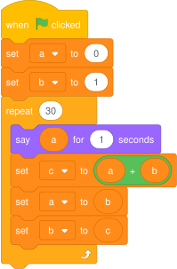
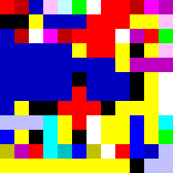
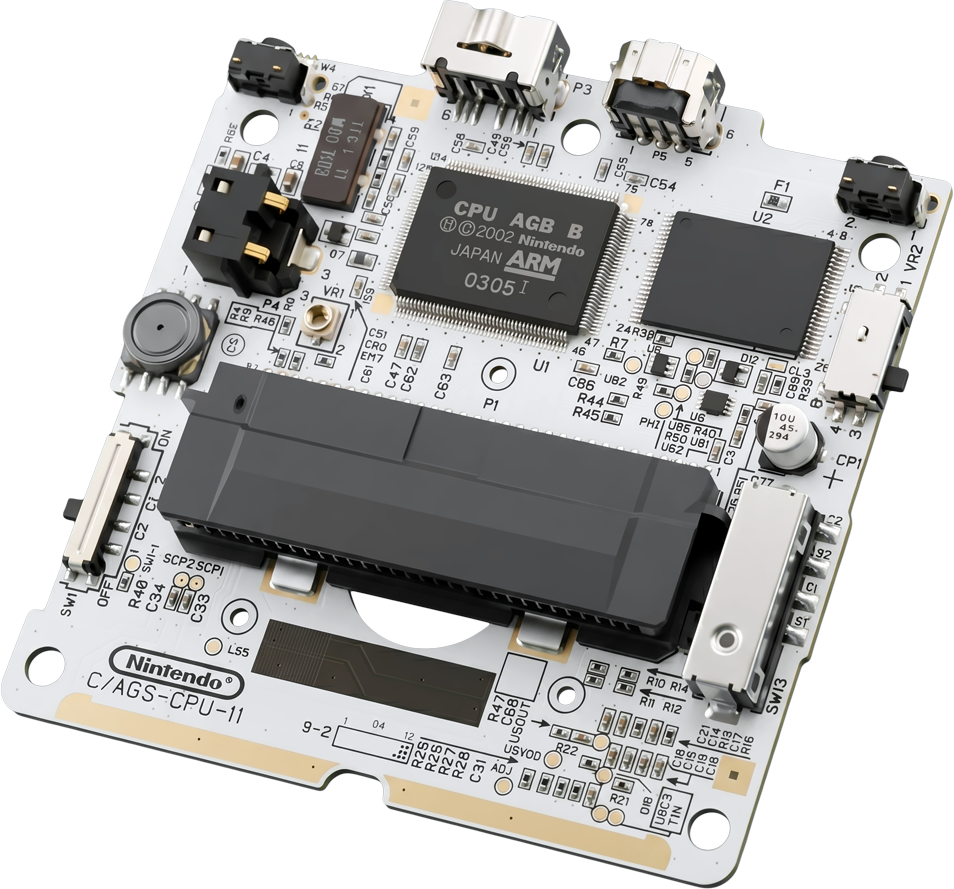

# Les bases en programmation

## Un programme ?

Un ==programme== est une suite d'==instructions== que la ==machine exécute==. Ces instructions sont formulées dans ==un langage de programmation==. Par exemple, les programmes suivants, écrits dans différents langages, calculent et affichent les premiers termes de la [suite de Fibonacci](https://fr.wikipedia.org/wiki/Suite_de_Fibonacci)&nbsp;:

=== ":material-language-python:{ .lg } Python"

    ```python
    a = 0
    b = 1
    for i in range(30):
        print(a, end=" ")
        suivant = a + b
        a = b
        b = suivant
    ```

=== ":material-language-c:{ .lg } Langage C"

    ```c
    #include <stdio.h>

    int main() {
        int a = 0;
        int b = 1;
        for (int i = 0; i < 30; i++) {
            printf("%d ", a);
            int suivant = a + b;
            a = b;
            b = suivant;
        }
    }
    ```


=== ":lucide-cat:{ .lg } Scratch"

    { .center-img }

=== ":material-lambda:{ .lg } Lisp"

    ```lisp
    (let loop ((i 0) (a 0) (b 1))
    (when (< i 30)
        (display a) (display " ")
        (loop (+ i 1) b (+ a b))))
    ```

=== ":lucide-brush:{ .lg } Piet"

    { .center-img }
    /// caption
    En Piet, le code se dessine&nbsp;!<br>C'est un langage [**exotique**](https://fr.wikipedia.org/wiki/Langage_de_programmation_exotique)&nbsp;: inutile, mais fascinant&nbsp;!
    ///

!!! info "Vocabulaire"
    Les mots *programme*, *script* et *code* veulent dire à peu près la même chose. Ils désignent le ou les fichiers texte qui contiennent les instructions.
    
    Un script Python est un fichier d'extension `.py`.

Chaque langage a ses forces et ses faiblesses. En NSI, nous utilisons **Python** : c'est un langage populaire dont la syntaxe est relativement simple. En contrepartie, il masque certaines subtilités du fonctionnement des machines et s'exécute moins vite que des langages comme le C.

??? note "La machine est polyglotte ?"
    Pas vraiment. Au sein d'une machine, les instructions sont exécutées par le **processeur**, la puce qui fait office de « cerveau ». Ce processeur ne comprend qu'un seul langage : le **langage machine**, propre à chaque type de processeur.

    { .center-img width="300px" }
    /// caption
    Au centre du circuit de la Gameboy SP trône le processeur (ou CPU en anglais, *Central Processing Unit*). Source : jackvmakes.
    ///

    Quand on exécute un programme Python, les instructions ne sont pas directement exécutées par le processeur. Un programme intermédiaire, appelé *interpréteur*, les traduit en langage machine **au fur et à mesure de l'exécution**.

    D'autres langages, comme le C, fonctionnent différemment : la traduction se fait **en une seule fois avant l'exécution**, grâce à un programme appelé *compilateur*.

    Mais si le « traducteur » est lui-même un programme, qui a traduit le traducteur ? 

## Programmer chez soi avec Thonny

On n'apprend pas le piano en lisant une partition, et on n'apprend pas à coder en lisant du code. Il faut **pratiquer**, **pratiquer** et **encore pratiquer**&nbsp;! Je vous recommande d'installer [Thonny](https://thonny.org) sur votre ordinateur personnel. C'est un éditeur de code Python gratuit qui réunit dans une interface simple tous les outils dont un débutant a besoin. Le logiciel se décompose en trois parties&nbsp;:


<div class="img-spotlight" markdown>

{ width="600px" .center-img }
{ width="600px" .center-img }


<!-- La barre d'outils présente trois boutons liés à l'exécution du programme courant&nbsp; :

<div class="icon-list" markdown>
:fontawesome-solid-play-circle:{ .green-text }
:   Exécute le programme courant
:fontawesome-solid-bug:{ .cyan-text }
:   Exécute **pas à pas** le programme courant
:fontawesome-solid-octagon:{ .red-text }
:   **Arrête** le programme en cours d'exécution
</div> -->


## Un premier programme

Au commencement était…

```python
print("Hello, world!")
```

Ce programme *imprime* (*print* en anglais), ou plutôt affiche, dans la console le message «&nbsp;Hello, world!&nbsp;»&nbsp;; un rituel de passage de tout étudiant en informatique depuis [1978](https://fr.wikipedia.org/wiki/Hello_world).


<video autoplay muted loop playsinline class="center-img rounded-video" width="600px">
  <source src="assets/print-hello.mp4" type="video/mp4">
</video>
/// caption
:lucide-circle-play: ou ++f5++ exécute le programme
///


On peut enchaîner plusieurs instructions `#!py print` :

```python
print("N'importe qui peut écrire du code qu'un ordinateur comprend.")
print('Les bons programmeurs écrivent du code que les humains comprennent.')
print('Martin Fowler')
```

Un programme s'exécute ligne par ligne, de haut en bas, comme vous liriez un texte. Chaque ligne de code terminée, la machine passe automatiquement à la suivante. C'est ce qu'on appelle le ==flot d'exécution== naturel. On peut s'en rendre compte en exécutant pas à pas le programme avec le déboggueur :

<div class="grid" markdown>

<video autoplay muted loop playsinline class="center-img rounded-video">
  <source src="assets/print-run.mp4" type="video/mp4">
</video>
/// caption
:lucide-circle-play: ou ++f5++ exécute le programme sans s'arrêter
///


<video autoplay muted loop playsinline class="center-img rounded-video">
  <source src="assets/print-steps.mp4" type="video/mp4">
</video>
/// caption
:lucide-bug: exécute le programme pas à pas<br>:lucide-redo-dot: ou ++f6++ exécute la ligne courante.
///

</div>

??? note "`#!py "message"` ou `#!py 'message'` ?"

    En Python, guillemets simples et doubles sont interchangeables. Le choix devient utile quand le texte contient l'un de ces caractères, on utilise alors l'autre type pour éviter d'avoir à l'**échapper** avec `\` :

    ```python
    print("N'importe qui peut écrire du code.")
    print('Il a pas dit "bonjour".')
    print('N\'importe qui peut écrire du code.')
    ```

    Choisissez le type qui n'oblige pas à échapper, et restez cohérent.

<!-- ## Exercices et quizz

!!! question "Quizz"

    1. Quelle est l'extension d'un script Python ?

        * `.py`
        * `.python`
        * `.txt`
        * `.script`

    
    2. Pour afficher « Bonjour » dans la console :

        * `afficher('Bonjour')`
        * `print(Bonjour)`
        * `print('Bonjour')`
        * `print 'Bonjour'`


    2. Lorsque la machine exécute ce programme :

        ```python
        print('Hello')
        print('Salut')
        print('Ciao')
        print('Привет')
        ```

        * Elle affiche les 4 messages en même temps.
        * Elle affiche « Hello » puis « Salut » etc. -->


## Une bête calculatrice

Dans la console, on saisit une ligne de code après les trois chevrons `#!py >>>` puis on appuie sur ++enter++ pour l'exécuter et afficher son résultat.


<video autoplay muted loop playsinline class="center-img rounded-video" width="600px">
  <source src="assets/console-thonny.mp4" type="video/mp4">
</video>
/// caption
La console permet de tester rapidement une ligne de code.
///

En fait, une ligne de code

<video autoplay muted loop playsinline class="center-img rounded-video" width="600px">
  <source src="assets/expression-thonny.mp4" type="video/mp4">
</video>
/// caption
:lucide-corner-right-down: ou ++f7++ entre dans une expression pas à pas
///

Une ==expression== est une portion de code qui, une fois ==évaluée==, se réduit à **une seule valeur**. Par exemple, l'expression `3 + 2` est évaluée à `5` par la machine, c'est la valeur affichée dans la console !

`print(print())`

## Valeurs & types

Au fond, pour une machine, tout n'est que calcul. Que vous lanciez TikTok, Brawl Stars ou un simulateur de physique nucléaire, la machine fait toujours la même chose : des milliards d'opérations par seconde. Votre rôle, c'est simplement de lui dire lesquelles ; ce qui est, il est vrai, légèrement plus délicat.


## Variables

## Conditions

Notion de blocs de code

## Fonctions


## Boucles