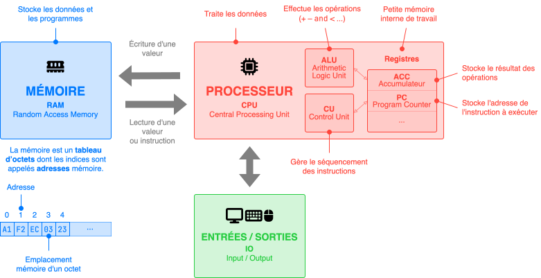
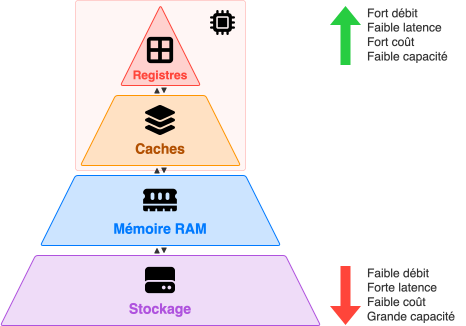

<style>
    .memory-level {
        display: flex;
        align-items: center;
        margin-top: 0.5rem;
    }

    .label {
        width: 6rem;
        font-weight: bold;
    }

    .cycle-info {
        width: 5rem;
        font-size: 0.8em;
        color: var(--md-default-fg-color--light);
    }

    .slider {
        position: relative;
        flex-grow: 1;
        height: 20px;
        background-color: var(--md-code-bg-color);
        border-radius: 1rem;
    }

    .ball {
        position: absolute;
        width: 16px;
        height: 16px;
        border-radius: 50%;
        top: 2px;
        left: 2px;
        background-color: rgb(var(--custom-blue));
        animation-timing-function: linear;
        animation-iteration-count: infinite;
        animation-name: bounce;
    }

    @keyframes bounce {

        0%,
        100% {
            left: 2px;
        }

        50% {
            left: calc(100% - 18px);
        }
    }
</style>

## Architecture de Von Neumann



* Le **cycle** d'une machine séquentielle se répète jusqu'à l'arrêt de la machine :
    <div class="no-bullet" markdown>

    * <span class="blue-text">:material-numeric-1-circle:</span> &nbsp; Le processeur **récupère** l'instruction à exécuter en mémoire à l'adresse <tt>PC</tt>.
    * <span class="blue-text">:material-numeric-2-circle:</span> &nbsp; Le processeur **décode** et **exécute** l'instruction.
    * <span class="blue-text">:material-numeric-3-circle:</span> &nbsp; Le processeur passe à l'instruction suivante (en incrémentant <tt>PC</tt>) et ainsi de suite.
    
    </div>

* Un programme est une suite d'**instructions** en **code machine** spécifique à un processeur, c'est-à-dire une suite d'octets que le processeur décode puis exécute. Ce code machine est souvent traduit en **code assembleur** pour faciliter sa lecture :

    <div class="grid" markdown>

    ```asm {.no-copy title="Code machine"}
    00011010
    00100010 
    00010011
    00000011
    01111000 
    ```

    ```tasm {.no-copy title="Code assembleur"}
    LD A, (DE) 
    LD (HL+), A 
    INC DE 
    DEC BC 
    LD A, B 
    ```

    </div>

## Compléments

### Autour des mémoires

{ .center-img }

<div class="center-table" markdown>

| Mémoire                                                                                                            | Volatilité | Capacité       | Débit    | Temps d'accès |
| :----------------------------------------------------------------------------------------------------------------- | :--------- | :------------- | :------- | :------------ |
| <span style="color: rgb(var(--custom-red));" markdown>:fontawesome-solid-border-all: &nbsp; **Registres**</span>   | Volatile   | 32 ko          | 500 Go/s | 1 ns          |
| <span style="color: rgb(var(--custom-orange));" markdown>:fontawesome-solid-layer-group: &nbsp; **Caches**</span>  | Volatile   | 512 ko ~ 16 Mo | 300 Go/s | 10 ns         |
| <span style="color: rgb(var(--custom-blue));" markdown>:fontawesome-solid-memory: &nbsp; **RAM**</span>            | Volatile   | 16 Go          | 50 Go/s  | 100 ns        |
| <span style="color: rgb(var(--custom-purple));" markdown>:fontawesome-solid-hard-drive: &nbsp; **Stockage**</span> | Permanent  | 1 To           | 500 Mo/s | 100 μs        |

</div>

* Une mémoire est dite **volatile** si elle perd son contenu sans alimentation électrique, et **permanente** si elle conserve ses données même après coupure de courant.

* Une mémoire de stockage peut être de type **ROM** (*Read Only Memory*, ou mémoire morte), qui ne peut être que lue (pas d'écriture possible). Typiquement une cartouche de jeu.

* Les **mémoires cache** sont de petites mémoires rapides dans le CPU qui évite de trop attendre les données venant de la RAM en conservant celles qu'on utilise souvent ou bientôt. L'animation ci-dessous illustre les différents temps d'accès (ou latence) :

    <div class="memory-level" markdown="span">
    <div class="label" style="color: rgb(var(--custom-red));" markdown>:fontawesome-solid-border-all: &nbsp;  Registres</div>
    <div class="cycle-info">1 cycle</div>
    <div class="slider">
    <div class="ball" style="animation-duration: 1s; background-color: rgb(var(--custom-red));"></div>
    </div>
    </div>

    <div class="memory-level" markdown="span">
    <div class="label" style="color: rgb(var(--custom-orange));" markdown>:fontawesome-solid-layer-group: &nbsp; Caches</div>
    <div class="cycle-info">~10 cycles</div>
    <div class="slider">
    <div class="ball" style="animation-duration: 10s; background-color: rgb(var(--custom-orange));"></div>
    </div>
    </div>

    <div class="memory-level" markdown="span">
    <div class="label" style="color: rgb(var(--custom-blue));" markdown>:fontawesome-solid-memory: &nbsp; RAM</div>
    <div class="cycle-info">~100 cycles</div>
    <div class="slider">
    <div class="ball" style="animation-duration: 100s; background-color: rgb(var(--custom-blue));"></div>
    </div>
    </div>

    <div class="memory-level" markdown="span">
    <div class="label" style="color: rgb(var(--custom-purple));" markdown>:fontawesome-solid-hard-drive: &nbsp; Stockage</div>
    <div class="cycle-info">~100k cycles</div>
    <div class="slider">
    <div class="ball" style="animation-duration: 100000s; background-color: rgb(var(--custom-purple));"></div>
    </div>
    </div>

### Autour du processeur

* Le processeur est cadencé au rythme d'une horloge interne de fréquence constante (en Hertz). Un **cycle d'horloge** correspond à la durée d'un cycle, soit l'inverse de la fréquence. Par exemple, un CPU cadencé à 3.3 Ghz effectue donc 3.3 milliards de cycles par seconde. Une instruction peut prendre un ou plusieurs cycles pour être complètement réalisée.

* La **loi de Moore** est une observation empirique formulée par Moore en 1965, qui énonçait que le nombre de transistors dans les microprocesseurs doubles environ tous les deux ans. Cela signifie que la puissance de traitement des ordinateurs augmente également de manière exponentielle au fil du temps.

    <figure markdown>
    { width="600px"; }
    { width="600px"; }
    <figcaption>Chaque point représente ici un processeur entre 2000 et 2023. La gravure représente la taille des transistors.</figcaption>
    </figure>

* Architecture **monoprocesseur** : un seul processeur.
* Architecture **multiprocesseur** : plusieurs processeurs physiques travaillant ensemble.
* Un processeur moderne dispose de plusieurs unités de traitement appelées **cœurs**, chacun avec leurs propres registres, UAL, CU et mémoire cache, pouvant ainsi exécuter des instructions simultanément et indépendamment les uns des autres.

### Autour des langages de programmation

* Un langage **bas niveau** est proche du matériel : code machine, assembleur...
* Un langage **haut niveau** est proche du langage humain et plus abstrait : Python, Scratch...
* Un langage **interprété** est traduit en code machine **pendant l'exécution** : Python, JavaScript...
* Un langage **compilé** est traduit en code machine **avant l'exécution** : C, Rust...

## Systèmes sur puce (SoC)

* Un **SoC** (*System on a Chip* ou *Système sur puce*) est une puce qui regroupe tous les composants essentiels d'un ordinateur classique : processeur (CPU), mémoire vive (RAM), processeur graphique (GPU) et circuits de communication (Wi-Fi, Bluetooth…).

* Ces puces sont très **compactes** (quelques cm²) et surtout conçues pour **consommer beaucoup moins d'énergie** qu'un ordinateur traditionnel à puissance équivalente.

* On les retrouve dans les **smartphones**, les **consoles de jeux portables** (comme la Nintendo Switch), les **nano-ordinateurs** (comme le Raspberry Pi), et même certains **ordinateurs portables récents** (comme les MacBook d'Apple depuis 2021).

* Le **marché des SoC** est en forte croissance et joue un rôle majeur dans l'évolution des technologies mobiles et embarquées.

* À gauche, la puce M1 Ultra d'Apple en comparaison avec un processeur de chez AMD, et à droite, l'architecture de la puce M1 Max d'Apple :

<div style="display: flex; justify-content: center; gap: 16px; align-items: flex-start; flex-wrap: wrap;">
  
  
</div>