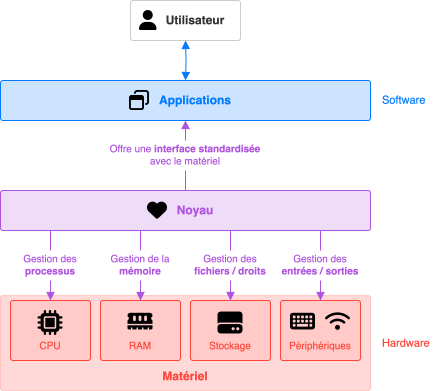
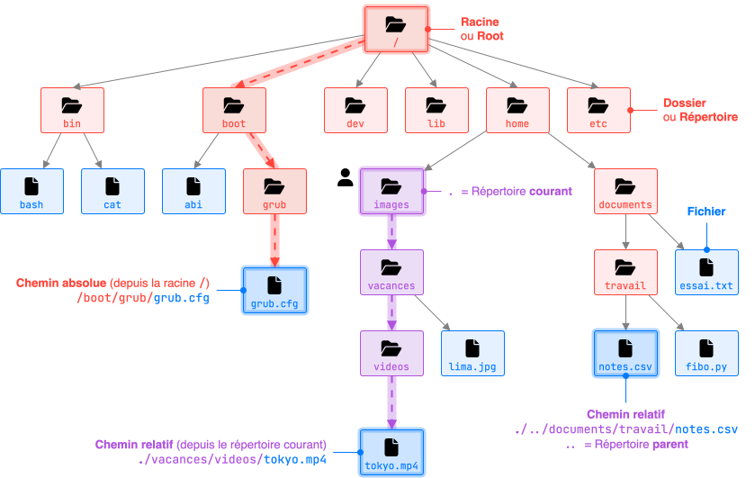
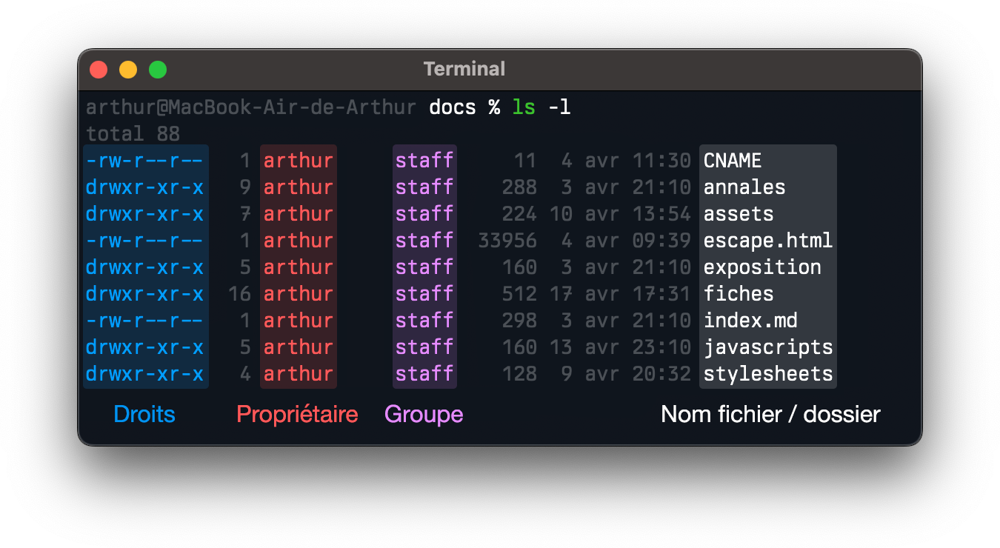
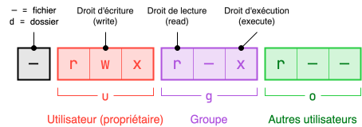
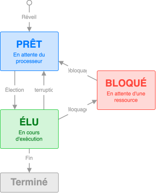
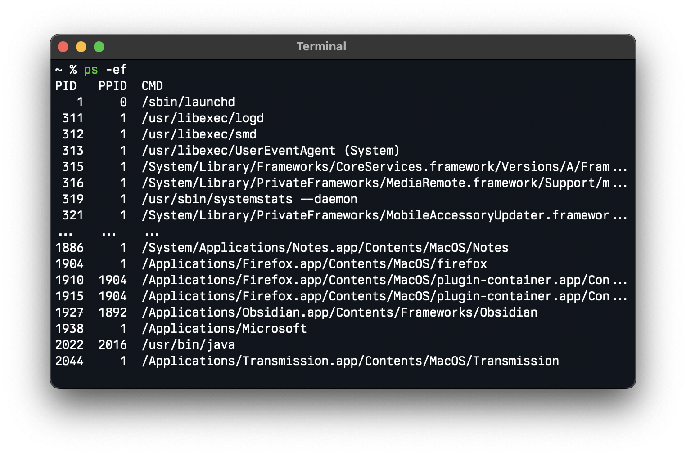
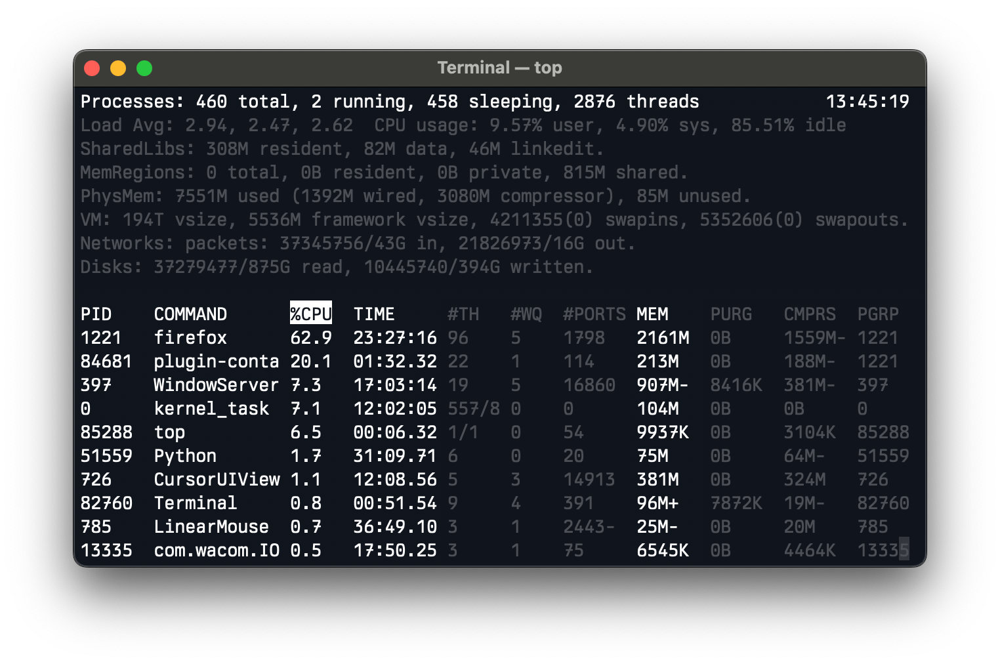
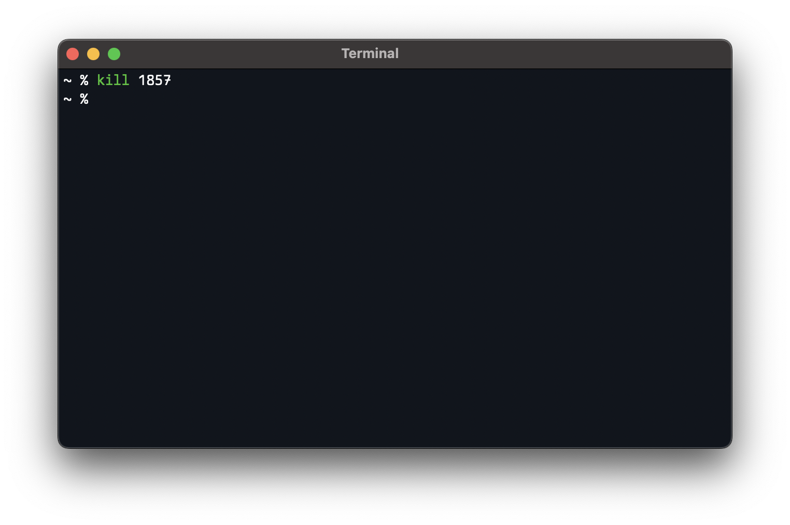

## Définition

* Un **système d'exploitation** (ou **OS**, *Operating System*) est un logiciel qui sert d'intermédiaire entre les programmes et le matériel de l'ordinateur (CPU, RAM, disques, périphériques, etc.).

* Il offre une **interface standardisée** permettant d'éviter aux programmes de se soucier des spécificités du matériel.

* L'OS est le **premier programme lancé** au démarrage et reste actif en permanence.

* Parmi les OS courants : **Windows**, **Linux**, **macOS**, **Android**, **iOS**.

* Le **noyau** (ou **kernel**) est la partie centrale de l'OS. Ses principales fonctionnalités :
    

    | Fonctionnalité                  | Description                                                                                                                     |
    | ------------------------------- | ------------------------------------------------------------------------------------------------------------------------------- |
    | **Gestion de la mémoire**       | Gère la mémoire RAM allouée aux programmes.                                                                                     |
    | **Gestion des processus**       | Permet l'exécution simultanée de plusieurs processus (programmes).                                                              |
    | **Gestion des entrées/sorties** | Permet aux programmes de communiquer avec les périphériques matériels (clavier, mémoire de stockage, carte réseau, écran etc.). |
    | **Gestion des fichiers**        | Organise, stocke et permet l'accès aux données sur les supports de stockage (création, lecture, écriture...).                   |
    | **Gestion des droits**          | Gère les droits d'accès aux ressources système et aux fichiers.                                                                 |
    
    

    { .center-img }

## Logiciels propriétaires vs logiciels libres

On distingue deux grands types de logiciels :

* Un **logiciel propriétaire** a un code source fermé : il ne peut pas être modifié, ni partagé. Il est souvent payant. Exemples : Windows, macOS, iOS, Android.

* Un **logiciel libre** a un code source ouvert : il peut être utilisé, modifié et redistribué librement. Exemples : Linux, Ubuntu, Debian, LineageOS.

## Commandes UNIX

* Sur les OS basés sur UNIX (Linux ou macOS), les fichiers et les dossiers sont organisés en **arborescence** :

    

* Le **terminal** est la fenêtre (graphique ou texte) dans laquelle on tape des commandes.

* Le **shell** est le programme qui **interprète** ces commandes et les transmet au **noyau** du système.

* Quelques commandes UNIX de base :

| Commande | Description                                         | Options courantes             | Exemple                |
| -------- | --------------------------------------------------- | ----------------------------- | ---------------------- |
| `ls`     | Liste les fichiers et dossiers                      | `-l` (format long)            | `ls -l`                |
| `cd`     | Change de répertoire courant                        | —                             | `cd /boot/grub/`       |
| `pwd`    | Affiche le chemin du répertoire courant             | —                             | `pwd`                  |
| `mkdir`  | Crée un dossier                                     | —                             | `mkdir projets`        |
| `touch`  | Crée un fichier vide                                | —                             | `touch memo.txt`       |
| `cp`     | Copie un fichier ou un dossier                      | `-r` (récursif)               | `cp -r images backup`  |
| `mv`     | Déplace ou renomme un fichier                       | —                             | `mv notes.csv ..`      |
| `rm`     | Supprime un fichier ou dossier                      | `-r` (récursif), `-f` (force) | `rm -rf travail/`      |
| `cat`    | Affiche le contenu d'un fichier                     | —                             | `cat fibo.py`          |
| `man`    | Manuel d'une commande                               | —                             | `man ls`               |
| `grep`   | Recherche un motif dans un fichier                  | —                             | `grep "mdp" essai.txt` |
| `sudo`   | Exécute une commande avec les droits administrateur | —                             | `sudo rm -rf /`        |

## Droits utilisateurs et permissions

* UNIX distingue trois catégories d'utilisateurs et de droits :

| Utilisateur             | Anglais |  Symbole   |
| ----------------------- | ------- | :--------: |
| **Propriétaire**        | User    | <tt>u</tt> |
| **Groupe** associé      | Group   | <tt>g</tt> |
| **Autres** utilisateurs | Others  | <tt>o</tt> |

| Droit                 | Anglais   |  Symbole   |
| --------------------- | --------- | :--------: |
| Droit de **lecture**  | Read      | <tt>r</tt> |
| Droit d'**écriture**  | Write     | <tt>w</tt> |
| Droit d'**exécution** | Execution | <tt>x</tt> |

* Les droits pour chaque fichier et dossier sont visibles avec `ls -l` :

    { .center-img }

* Lecture des droits, par exemple `-rwxr-xr--` :

    { .center-img style="padding-top: 1rem;"}

* Seul le **propriétaire** ou un **administrateur** peut modifier les droits avec la commande `chmod` :

    * `chmod [u g o a] [+ - =] [r w x] nom_du_fichier` 
    * <tt>u</tt> / <tt>g</tt> / <tt>o</tt> / <tt>a</tt> : utilisateur, groupe, autres, tous (all)
    * <tt>+</tt> / <tt>-</tt> / <tt>=</tt> : ajoute / retire / remplace un droit
    * Exemple : `chmod g+w notes.txt`

## Processus

### Création et états d'un processus

* Quand un programme est lancé, un processus est créé par le système d'exploitation. Un processus contient :
    

    * :material-file-code: &nbsp; Les **instructions** du programme à exécuter (chargées en mémoire).
    * :fontawesome-solid-memory: &nbsp; Un **espace mémoire** réservé.
    * :fontawesome-solid-hard-drive: &nbsp; Des droits d'accès à certaines **ressources** (fichiers, périphériques…).
  
    

* Un **processus** peut être démarré au démarrage du système, par l'utilisateur, par un périphérique ou par un autre processus appelé **parent**.

* Chaque processus possède un **identifiant unique (PID)** et celui de son parent (PPID). Cela permet de structurer les processus en arbre. Si un processus parent se termine, tous ses processus enfants (et leur descendance) sont également arrêtés.

* Un processeur n'exécute qu'une seule instruction à la fois, donc un seul processus à la fois. Pour donner l'illusion de simultanéité d'exécution, les processus se partagent le processeur à tour de rôle. Ainsi, un processus peut donc se trouver dans différents **états** :

    { .center-img }

### Commandes UNIX relatifs aux processus

=== ":material-camera-enhance: &nbsp; `ps`"

    `ps` affiche **un cliché instantané** des processus en cours d'exécution. Les options `-ef` permet d'afficher tous les processus avec informations détaillées.

    { width="600px" .center-img }

=== ":material-monitor-eye: &nbsp; `top`"

    `top` affiche **en temps réel** les processus actifs et leur consommation flsystème (CPU, mémoire...).

    { width="600px" .center-img }

=== ":material-skull: &nbsp; `kill`"

    `kill <PID>` **termine** le processus identifié par son PID. L'option `-9` permet de forcer l'arrêt immédiat du processus, sans lui laisser la possibilité de se terminer de manière contrôlée.

    { width="600px" .center-img }

### Ordonnancement des processus

L'**ordonnanceur** est un programme du système d'exploitation qui choisit le processus à élire, l'interrompt si nécessaire, et définit le temps processeur (mesuré en cycles) qui lui est alloué. Pour cela, il peut appliquer différentes **stratégies d'ordonnancement**, selon des critères comme la priorité des processus, leur durée estimée, leur ordre d'arrivée, un partage équitable du temps etc. Voici quelques stratégies d'ordonnancement pour les quatre processus suivants :

### Interblocage (deadlock)

L'**interblocage** est une situation où plusieurs processus sont bloqués, chacun attendant une ressource détenue par un autre, aboutissant à un blocage mutuel et infini.

  <button class="nav prev">:material-arrow-left-circle:</button>
  

    
    
    
    
    
    
    
    
    
    
    
    
  

  <button class="nav next">:material-arrow-right-circle:</button>
  

    
    
    
    
    
    
    
    
    
    
    
    
  

