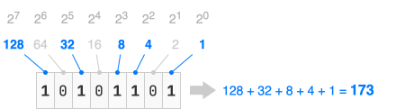
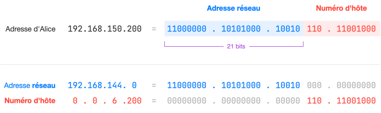
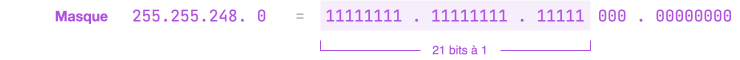
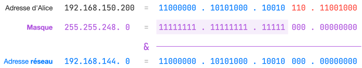
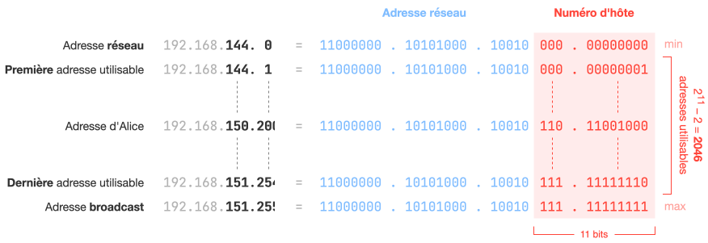
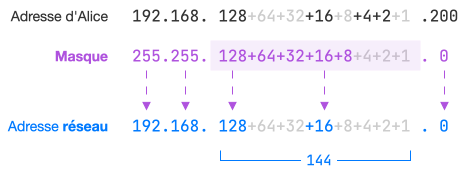
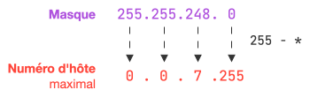
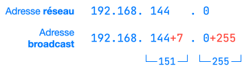
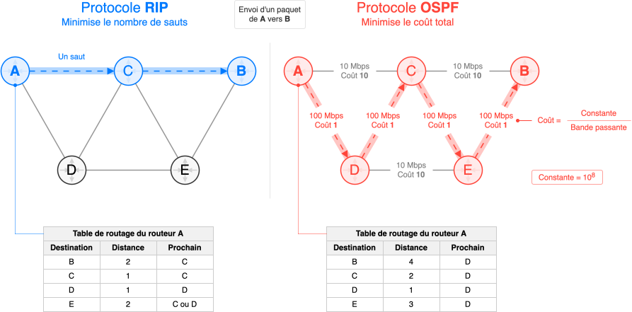

## Rappels sur le binaire

* **Base 2 :octicons-arrow-right-24: Base 10**

    { .center-img style="padding-bottom: 0.5rem;"}

* **Base 10 :octicons-arrow-right-24: Base 2** : On décompose le nombre en **une somme de puissances de 2** :
    $$
    \begin{aligned} 
    151 &= 128 +  \underline{23} \newline
    &= 128 + 16 + \underline{7} \newline
    &= 128 + 16 + 4 + \underline{3} \newline
    &= 128 + 16 + 4 + 2 + 1 \newline
    &= 2^7 + 2^4 + 2^2 + 2^1 + 2^0 \newline
    &= (10010111)_2
    \end{aligned}$$

## Adresses IP

* Chaque **hôte** (machine) est localisé sur le réseau par une **adresse IP**. Elle est composée de 4 octets (donc 4 × 8 = 32 bits). Par exemple, Alice a pour adresse IP `192.168.150.200`. 

* Une adresse IP peut se couper en deux : **l'adresse réseau** (ou de sous-réseau) et **le numéro de l'hôte** sur ce réseau. Chaque hôte définit les **$k$ premiers bits** qui correspondent à leur adresse réseau. Par exemple, Alice choisit `/21` (notation CIDR du masque) :

    { .center-img style="padding: 1rem 0 1rem 0;"}

* Au lieu de définir $k$, on définit souvent à la place un **masque de sous-réseau** où les $k$ premiers bits sont à 1 et le reste à 0 :

    { .center-img style="padding: 1rem 0 1rem 0;"}

* Le masque permet d'extraire l'adresse de sous-réseau d'une adresse IP en masquant la partie du numéro de l'hôte. Pour cela, on effectue un **ET Logique bit à bit** (opérateur <tt>&</tt>) entre l'adresse IP et le masque. Les 1 du masque laissent passer les bits de l'adresse réseau tandis que les 0 masquent le numéro de l'hôte :

    { .center-img style="padding: 1rem 0 1rem 0;"}

* S'il y a $n = 32 − k$ bits réservés pour le numéro de l'hôte, alors il y a $2^n$ numéro d'hôtes possibles. Cependant, on perd l'adresse réseau (numéro d'hôte à 0) et l'adresse de broadcast IP (numéro d'hôte maximal). Ainsi, le nombre de machines que l'on peut connecter à ce sous-réseau est $2^n − 2$ :

    { .center-img style="padding: 1rem 0 1rem 0;"}

    Ainsi la plage des adresses IP sur le réseau d'Alice :
    
    * Première adresse IP utilisable du réseau : `192.168.144.1`
    * Dernière adresse IP utilisable du réseau : `192.168.151.254`
    
* Une machine ne peut pas communiquer directement avec une autre machine qui n'est pas sur son réseau. Pour établir la communication entre ces deux réseaux, on les relie par un ou plusieurs **routeurs** (aussi appelés **passerelles**).

??? tip "Astuces de calculs"

    * Un octet du masque ayant la valeur 255 (`11111111` en binaire) ne modifie pas l'octet correspondant de l'adresse IP. Et un octet du masque ayant la valeur 0 aboutit systématiquement à 0. Pour les autres valeurs du masque comme 248, elles peuvent rester sous la forme d'une somme de puissances de 2 :

        { .center-img style="padding: 1rem 0 1rem 0;" }

    * Pour **déterminer toutes les adresses IP d'hôtes utilisables** d'un réseau sachant son adresse réseau et son masque, on commence par calculer le numéro d'hôte maximal à partir du masque :

        { .center-img style="padding: 1rem 0 1rem 0;" }

        On ajoute à l'adresse réseau ce numéro d'hôte pour obtenir la dernière adresse (broadcast) :

        { .center-img style="padding: 1rem 0 1rem 0;" }

        En excluant les adresses IP inutilisables — l'adresse réseau et l'adresse broadcast — les adresses IP utilisables du réseau vont ici de `192.168.144.1` à `192.168.151.254`.

## Protocoles de routage

* **RIP** (*Routing Information Protocol*) est un protocole de routage à vecteur de distance qui utilise le **nombre de sauts** (hops) comme métrique. Chaque routeur envoie sa table de routage à ses voisins toutes les 30 secondes. Au départ, seuls les voisins directs sont connus, puis les tables se complètent à chaque échange et se stabilisent.

* **OSPF** (*Open Shortest Path First*) est un protocole de routage à état de lien où chaque routeur découvre ses voisins et échange des informations de topologie pour construire une carte complète du réseau. Il calcule ensuite le chemin le plus court vers chaque destination en minimisant un **coût** basé sur **la bande passante**, mesurée en bits par seconde (bps) :
    $$\text{Coût} = \frac{\text{Constante}}{\text{Bande passante}}
    $$
    Souvent, la constante vaut $10^8$.

## Sécurisation des communications

Il existe deux types de **chiffrement** :

* **Symétrique** : **1 clé** unique pour chiffrer et déchiffrer.
* **Asymétrique** : **2 clés**, une pour chiffrer (clé publique), une autre pour déchiffrer (clé privée).

Le chiffrement asymétrique sert à échanger une clé symétrique en début de communication. Ensuite, les échanges utilisent le chiffrement symétrique (plus rapide).
