## Modèle Relationnel

{ .invert }

Concernant les **clés étrangères** : 

* Les clés étrangères permettent de relier des tables, et ainsi, d'éviter les **redondances** et faciliter les modifications.

* Une clé étrangère doit toujours être une référence **valide** (*contrainte d'intégrité référentielle*). Ainsi, pour supprimer un auteur, il faut d'abord supprimer tous les livres qui lui sont associés.

Le **schéma relationnel** s'écrit comme :

* <tt style="font-size: .9em">Livres(<u>isbn</u>: TEXT, titre: TEXT, annee: INT, #id_auteur)</tt>
* <tt style="font-size: .9em">Auteurs(<u>id</u>: INT, nom_complet: TEXT, annee_naissance: INT, pays: TEXT)</tt>

Les clés primaires sont <u>soulignés</u> et les clés étrangères sont précédées d'un <tt>#</tt>. 

## Requêtes SQL

* Récupérer des données d'une table :

    ```{.sql .no-copy}
    SELECT colonne, autre_colonne, ...
    FROM nom_table
    WHERE condition AND/OR autre_condition AND/OR ...
    ORDER BY colonne ASC/DESC
    ```

* Récupérer des données de plusieurs tables (jointure) :
  
    ```{.sql .no-copy}
    SELECT table1.colonne, table2.colonne, ...
    FROM table1
    JOIN table2 ON table1.id = table2.id
    JOIN table3 ON table2.id = table3.id
    ...
    WHERE condition(s)
    ORDER BY colonne ASC/DESC
    ```

* Ajouter une ligne :

    ```{.sql .no-copy}
    INSERT INTO nom_table
    VALUES (valeur1, valeur2, ...)
    ```

* Mettre à jour une ou des lignes :

    ```{.sql .no-copy}
    UPDATE nom_table
    SET colonne = valeur_ou_expression, 
        autre_colonne = valeur_ou_expression, 
        ...
    WHERE condition(s)
    ```

* Supprimer une ou des lignes :

    ```{.sql .no-copy}
    DELETE FROM nom_table
    WHERE condition(s)
    ```