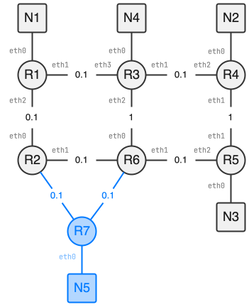

<!--NAVIGATION_START-->

[:material-home:](../index.md/#sujets-2024){ .md-button .nav-button }
[:fontawesome-solid-file-pdf: &nbsp; Énoncé](../exercices/24-NSI0A-1.pdf){ .md-button }
[:fontawesome-solid-file-pdf: &nbsp; Sujet](../sujets/24-NSI0A.pdf){ .md-button }
[:material-arrow-right:](24-NSI0A-2.md){ .md-button .nav-button }

<!--NAVIGATION_END-->

1. La commande `ping` renvoie « Hôte inaccessible » malgré une connexion physique fonctionnelle, car les deux machines appartiennent à des réseaux locaux différents. En effet, M1 est sur le réseau `192.168.1.0` et M2 sur le réseau `192.168.2.0`.

2. L'acronyme RAM signifie **Random Access Memory**, ou *mémoire à accès aléatoire* en français. C'est une mémoire où chaque emplacement mémoire (souvent un octet) peut être lu ou écrit en temps constant, peu importe son adresse.

3. Linux est un **système d'exploitation** libre. 

4. Un routeur relie au moins deux réseaux locaux. Il doit donc disposer d'au moins deux interfaces, chacune configurée avec une adresse valide dans le réseau auquel elle est connectée.

5. Une adresse canonique pour l'interface d'un routeur est souvent la dernière adresse IP utilisable du réseau. Ici, le réseau est `192.168.1.0/24`, donc cette adresse correspond à `192.168.1.254`.

6. La paquet suit la route **N1 → R1 → R3 → R4 → N2**.

7. 
| Destination | Interface de sortie | Métrique |
| :---------: | :-----------------: | :------: |
|     N1      |        eth0         |    0     |
|     N2      |        eth2         |    4     |
|     N3      |        eth2         |    3     |

1.  * Fibre : $10^8 / 10^9 = \boxed{0.1}$
    * Fast-Ethernet : $10^8 / (100 \cdot 10^6) = \boxed{1}$
    * Ethernet : $10^8 / (10 \cdot 10^6) = \boxed{10}$

2. Soit $x$ le coût de la liaison R2–R6. Lorsqu'un paquet part de R1 vers N2 en passant par l'interface `eth2`, il peut emprunter l'une des deux routes suivantes :

    * R1 → R2 → R6 → R3 → R4 → N2 de coût total $0.1 + x + 1 + 0.1 = x + 1.2$
    * R1 → R2 → R6 → R5 → R4 → N2 de coût total $0.1 + x + 0.1 + 1 = x + 1.2$

    Les deux chemins ont donc un même coût total de $x + 1.2$. D'après la table de routage, le coût total de R1 vers N2 est de 1.3. On en déduit que $x = 1.3 - 1.2 = 0.1$, donc la liaison R2–R6 est de type **Fibre**.

3.  
| Destination | Interface de sortie | Métrique |
| :---------: | :-----------------: | :------: |
|     N1      |        eth0         |    0     |
|     N2      |        eth1         | **0.2**  |
|     N2      |        eth2         |   1.3    |
|     N3      |        eth1         | **1.2**  |
|     N3      |        eth2         |   0.3    |
|     N4      |        eth1         | **0.1**  |
|     N4      |        eth2         |   1.2    |

1.  { .center-img }

