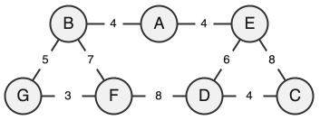

<div class="circle-ol" markdown>

1. { .center-img }

2. Le chemin **A — E – D** de longueur de 10 km est le plus court chemin entre A et D.

3. \[G_1 = \begin{pmatrix}
\ 0 & 4 & 0 & 0 & 4 & 0 & 0 \ \\
\ 4 & 0 & 0 & 0 & 0 & 7 & 5 \ \\
\ 0 & 0 & 0 & 4 & 8 & 0 & 0 \ \\
\ 0 & 0 & 4 & 0 & 6 & 8 & 0 \ \\
\ 4 & 0 & 8 & 6 & 0 & 0 & 0 \ \\
\ 0 & 7 & 0 & 8 & 0 & 0 & 3 \ \\
\ 0 & 5 & 0 & 0 & 0 & 3 & 0 \ \\
\end{pmatrix}
\]

4. 
```python
d = {'A': ['B', 'C', 'H'],
     'B': ['A', 'I'],
     'C': ['A', 'D', 'E'],
     'D': ['C', 'E'],
     'E': ['C', 'D', 'G'],
     'F': ['G', 'I'],
     'G': ['E', 'F', 'H'],
     'H': ['A', 'G', 'I'],
     'I': ['B', 'F', 'H']}
```

5. Un parcours en largeur du graphe G2 depuis A peut donner l'ordre : 
   <center style="margin-bottom: 0.2rem;" markdown="span">**A → <span class="blue-text">B → C → H →</span> <span class="red-text">I → D → E → G →</span> <span class="purple-text">F</span>**
   </center>
   L'ordre de visite des sommets d'une même couleur est arbitraire.

6. La fonction `cherche_itineraires` est récursive car **elle s'appelle elle-même** (ligne 8). 

7. La fonction `cherche_itineraires` explore récursivement tous les chemins possibles à partir du sommet `start` dans le graphe `G`. Au cours de cette exploration, elle ajoute dans la liste `chaine` les chemins qui terminent par le sommet `end`. Un chemin est stocké sous la forme d'une liste de sommets.

8. 
```python hl_lines="3 6 7 10"
def itineraires_court(G, dep, arr):
    cherche_itineraires(G, dep, arr)
    tab_court = []
    mini = float('inf')
    for v in tab_itineraires:
        if len(v) <= mini:
            mini = len(v)
    for v in tab_itineraires:
        if len(v) == mini:
            tab_court.append(v)
    return tab_court
```

1. Lors du premier appel de la fonction `itineraires_court`, la liste globale `tab_itineraires` est intialement vide. La fonction `cherche_itineraires` peut alors y stocker correctement les itinéraires trouvés.

    Cependant, cette liste n’est jamais réinitialisée en une liste vide. Ainsi, lors d’un second appel à `itineraires_court`, les nouveaux itinéraires sont ajoutés aux précédents, ce qui fausse par conséquent le résultat de `itineraires_court`.

    Pour éviter cette erreur, une solution serait de réinitialiser `tab_itineraires` au début de la fonction `itineraires_court`.

2.  Un SGBD permet par exemple d'assurer la **cohérence** des données (en évitant les doublons ou incohérences) et leur **sécurité** (en contrôlant les accès et en protégeant contre les pertes ou modifications non autorisées).

3.  Le schéma relationnel de la table `ville` :

    <center><tt style="font-size: .8em">ville(<u>id</u>: INT, nom: TEXT, num_dep: INT, nombre_hab: INT, superficie: FLOAT)</tt></center>

4.  L'attribut `id_ville` de la table `sport` est une **clé étrangère** qui fait référence à la clé primaire `id` de la table `ville`. Il permet de faire ainsi le lien entre ces deux tables.

5.  
|  `nom`   |
| :------: |
| Chamonix |

1.  
```sql
SELECT nom
FROM sport
WHERE type = 'piscine';
```

1.  
```sql
UPDATE sport
SET note = 7
WHERE nom = 'Ballon perdus';
```

1.  
```sql
INSERT INTO ville
VALUES (8, 'Toulouse', 31, 471941, 118.0)
```

1.  
```sql
SELECT sport.nom
FROM ville
JOIN sport ON sport.id_ville = ville.id
WHERE ville.nom = 'Annecy' AND type = 'mur d''escalade';
```

</div>