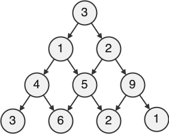

<!--NAVIGATION_START-->
<div class="center-button" markdown>
[:material-home:](../index.md/#sujets-2024){ .md-button .nav-button }
[:fontawesome-solid-file-pdf: &nbsp; Énoncé](../exercices/24-NSI0B-1.pdf){ .md-button }
[:fontawesome-solid-file-pdf: &nbsp; Sujet](../sujets/24-NSI0B.pdf){ .md-button }
[:material-arrow-right:](24-NSI0B-2.md){ .md-button .nav-button }
</div>
<!--NAVIGATION_END-->

<div class="circle-ol" markdown>

1. La liste donnée représente la pyramide :
    
    { width="200px" .center-img }

2. Le conduit **3 — 2 — 5 — 6** (ou encore le conduit **3 — 2 — 9 — 2**) dont le score est de 16 est un conduit de score de confiance maximal. 

3. Tous les conduits possibles de cete pyramide sont :
    * 2 — 5 — 2
    * 2 — 5 — 3
    * 2 — 1 — 3
    * 2 — 1 — 9

4. Suivant un tel codage, dans une pyramide de $n$ niveaux, tout nombre binaire de $n - 1$ bits représente un conduit, il y a donc en tout $2^{n - 1}$ conduits.

5. Énumérer toutes les conduits possibles implique d'explorer $2^{n - 1}$ conduits, ce qui aboutit à une complexité en temps d'au moins $O(2^n)$. Cette croissance exponentielle rend cette approche par recherche exhaustive trop lente dès que $n$ devient un peu trop grand.

6. 
```python
def score_max(i, j, p):
    if i == len(p) - 1:  # cas de base
        return p[-1][j]
    return p[i][j] + max(score_max(i + 1, j, p), score_max(i + 1, j + 1, p))
```

7. 
```python
def pyramide_nulle(n):
    return [[0] * (i + 1) for i in range(n)]
```

8. 
```python linenums="1"
def prog_dyn(p):
    n = len(p)
    s = pyramide_nulle(n)
    # remplissage du dernier niveau
    for j in range(n):
        s[-1][j] = p[-1][j]
    # remplissage des autres niveaux
    for i in range(n - 2, -1, -1):
        for j in range(i + 1):
            s[i][j] = p[i][j] + max(s[i + 1, j], s[i + 1, j + 1])
    # renvoie du score maximal
    return s[0][0]
```

9. Cette fonction remplit totalement le cache `s` qui contient autant d'éléments que la pyramide elle-même. Or, le nombre de sommets d'une pyramide de $n$ niveaux est :
$$
1 + 2 + 3 + \ldots + n = \frac{n(n + 1)}{2} = \frac{1}{2} n^2 + \frac{1}{2} n = O\big(n^2 \big)
$$
Puisque calculer le score maximal de confiance pour un sommet donné est en temps constant (lignes 6 et 10), la complexité en temps de cette fonction est donc quadratique.

10. Pour conserver une approche récursive, une approche élégante serait de définir `score_max` comme une fonction locale et définir le cache à l'extérieur :

    ```python
    def prog_dyn(p):
        def score_max(i, j):
            if not s[i][j]:  # si s[i][j] n'a pas été calculé (== None)
                s[i][j] = p[i][j] + max(score_max(i + 1, j), score_max(i + 1, j + 1))
            return s[i][j]

        # initialisation du cache (cas de base inclus)
        s = [[None] * (i + 1) for i in range(n - 1)] + [p[-1]] 
        return score_max(0, 0)
    ```

    Les éléments du cache sont initialisés à `#!py None` et non à 0 dans le cas où certains scores seraient nuls.

</div>