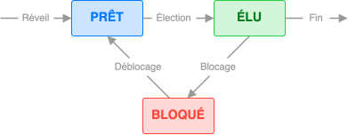
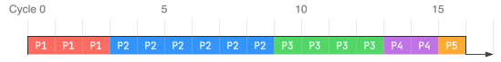
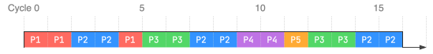

1. Un **logiciel libre** a un code source accessible, que chacun peut modifier et partager librement, contrairement à un **logiciel propriétaire**.

2. Un **système d'exploitation** est un programme qui sert d'intermédiaire entre les programmes et le matériel de l’ordinateur (CPU, RAM, stockage...). Il permet aux autres programmes d’utiliser les ressources matérielles sans avoir à se préoccuper de leurs spécificités.

3. `/home/elsa/documents/boulot/rapport.odt`

4. `../max/images/photos_vac/photo_1.jpg`

5. Après l'exécution de la commande, le répertoire `documents` reste inchangé et le répertoire `boulot` contient en plus le fichier `fiche.ods`.

6. { .center-img }

7. Un processus peut passer de l'état élu à l'état bloqué lorsqu'**il demande une ressource externe**, par exemple l'accès à un fichier sur la mémoire de stockage, qui n'est pas immédiatement disponible.

8. Une **pile** est une structure de données linéaire de type LIFO.

9. { .center-img }

10. { .center-img }

11. Si, à un moment donné, P1 possède R1 et P2 possède R2, une situation d'interblocage survient lorsque P1 demande R2 et que P2 demande R1. Chacun attend alors que l’autre libère sa ressource, et les deux processus restent bloqués indéfiniment.

