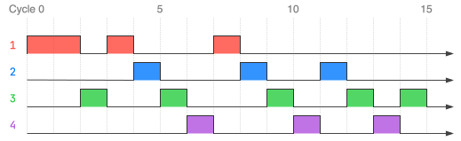

<div class="circle-ol" markdown>

1. Un processus peut se trouver dans l'un des trois états suivants : **Prêt**, **Élu** ou **Bloqué**.
   
2. Puisqu’aucune ressource n’est considérée dans ce contexte, un processus ne peut jamais se retrouver dans l'état Bloqué. Ainsi, les processus alternent ici entre l'état **Prêt** et **Élu**.
   
3. 
```python hl_lines="2 3"
def defile(self):
    if not self.contenu:
        return None
    return self.contenu.pop(0)
```

    La condition peut aussi s'écrire `#!py len(self.contenu) == 0` ou bien `#!py self.contenu == []`.

1. { .center-img }

2. 
```python hl_lines="8 14 15 17"
class Ordonnanceur:
    def __init__(self):
        self.temps = 0
        self.file = File()

    def ajoute_nouveau_processus(self, proc):
        """ Ajoute un nouveau processus dans la file de l'ordonnanceur. """
        self.file.enfiler(proc)

    def tourniquet(self):
        """ Effectue une étape d'ordonnancement et
        renvoie le nom du processus élu. """
        self.temps += 1
        if not self.file.est_vide():
            proc = self.file.defiler()
            proc.executer_un_cycle()
            if not proc.est_fini():
                self.file.enfiler(proc)
            return proc.nom
        else:
            return None
```

1. 
```python
p1 = Processus('p1', 4)
p2 = Processus('p2', 3)
p3 = Processus('p3', 5)
p4 = Processus('p4', 3)
depart_proc = {0: p1, 1: p3, 2: p2, 3: p4}

o = Ordonnanceur()
# tant qu'il reste des processus à démarrer ou en cours
while depart_proc or not o.file.est_vide():
    if o.temps in depart_proc:
        o.ajoute_nouveau_processus(depart_proc.pop(o.temps))
    print(o.tourniquet())
```

7. Dans la situation où :
    * B acquiert le clavier,
    * D acquiert le fichier,
    * B attend le fichier détenu par D,
    * D attend le clavier détenu par B.
  
    Chacun attend une ressource détenue par l'autre : il y a donc **interblocage**.

</div>