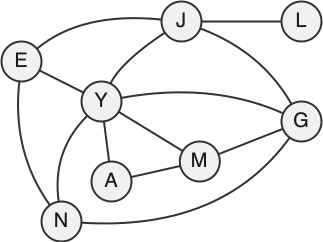

<div class="circle-ol" markdown>

1. { .center-img width="250px"}

2. 
```python
# sommets :     G, J, Y, E, N, M, A, L
matrice_adj = [[0, 1, 1, 0, 1, 1, 0, 0],  # G
			   [1, 0, 1, 1, 0, 0, 0, 1],  # J
			   [1, 1, 0, 1, 1, 1, 1, 0],  # Y
			   [0, 1, 1, 0, 1, 0, 0, 0],  # E
			   [1, 0, 1, 1, 0, 0, 0, 0],  # N
			   [1, 0, 1, 0, 0, 0, 1, 0],  # M
			   [0, 0, 1, 0, 0, 1, 0, 0],  # A
			   [0, 1, 0, 0, 0, 0, 0, 0]]  # L
```

3. 
```python
>>> position(sommets, 'G')
0
>>> position(sommets, 'Z')
None
```

4. 
```python hl_lines="2 4 7 8" 
def nb_amis(L, m, s):
	pos_s = position(L, s)
	if pos_s == None:
		return None
	amis = 0
	for i in range(len(m)):
		amis += m[pos_s][i]
	return amis
```

5. L'expression `#!py nb_amis(sommets, matrice_adj, 'G')` renvoie `#!py 4`.

6.  `c` représente une **clé**, et `v` est la **valeur associée** à cette clé.

7. 
```python
graphe = {
    'G': ['J', 'Y', 'N', 'M'],
    'J': ['G', 'Y', 'E', 'L'],
    'Y': ['G', 'J', 'E', 'N', 'M', 'A'],
    'E': ['J', 'Y', 'N'],
    'N': ['G', 'Y', 'E'],
    'M': ['G', 'Y', 'A'],
    'A': ['Y', 'M'],
    'L': ['J']
}
```

8. 
```python
def nb_amis(d, s):
	return len(d[s])
```

1. Le cercle d'amis de Lou est **J, G, Y, E, N**.

2.   
```python hl_lines="2 4 6"
def parcours_en_profondeur(d, s, visites = []):
	visites.append(s)
	for v in d[s]:
		if v not in visites:
			parcours_en_profondeur(d, v)
	return visites
```

</div>