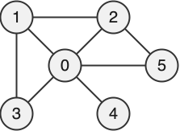

<!--NAVIGATION_START-->
<div class="center-button" markdown>
[:material-home:](../index.md/#sujets-2024){ .md-button .nav-button }
[:fontawesome-solid-file-pdf: &nbsp; Énoncé](../exercices/24-NSIJ1G11-1.pdf){ .md-button }
[:fontawesome-solid-file-pdf: &nbsp; Sujet](../sujets/24-NSIJ1G11.pdf){ .md-button }
[:material-arrow-right:](24-NSIJ1G11-2.md){ .md-button .nav-button }
</div>
<!--NAVIGATION_END-->

<div class="circle-ol" markdown>

1. 
```python
voisins = [
    [1, 2, 3, 4],
    [0, 2, 3],
    [0, 1],
    [0, 1],
    [0]
]
```

2. { width=150px" .center-img }

3. 
```python
voisins = [
    [1, 2, 3, 4, 5],
    [0, 2, 3],
    [0, 1, 5],
    [0, 1],
    [0],
    [0, 2]
]
```

4. 
```python
def voisin_alea(voisins, s):
    return voisins[s][random.randrange(len(voisins[s]))]
```

5. La fonction `marche_alea` est récursive car **elle s'appelle elle-même** (ligne 4).

6. Cette fonction simule une migration aléatoire du virus sur le réseau informatique. Elle renvoie le sommet (ordinateur) atteint après `n` sauts aléatoires depuis le sommet de départ `i`.  

7. 
```python
def simule(voisins, i, n_tests, n_pas):
    results = [0] * len(voisins)
    for _ in range(n_tests):
        results[marche_alea(voisins, i, n_pas)] += 1
    return [r / n_tests for r in results]
```

8.  **Protéger l'ordinateur 0 est donc le choix le plus rentable**, car le virus termine le plus souvent sa migration sur celui-ci, dans environ 33 % des cas.

9. Un **parcours en largeur** modélise parfaitement ce processus de propagation. Lors de ce parcours, les sommets sont visités par ordre croissant de leur distance (en nombre d'arêtes) au sommet initial `s`. Le nombre total d'étapes nécessaires pour que l'ensemble du réseau soit infecté correspond alors à la distance du dernier sommet visité.

    ```python
    def nb_etapes(voisins, s):
        file = [s]  # implémentation non-optimale d'une file
        distance = {s: 0}
        u = s  # dernier sommet visité
        while file:
            u = file.pop(0)
            for v in voisins[u]:
                if v not in distance:
                    distance[v] = distance[u] + 1
                    file.append(v)
        return distance[u]
    ```

</div>