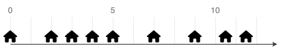
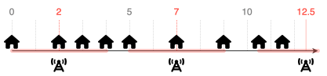

<!--NAVIGATION_START-->
<div class="center-button" markdown>
[:material-home:](../index.md/#sujets-2024){ .md-button .nav-button }
[:fontawesome-solid-file-pdf: &nbsp; Énoncé](../exercices/24-NSIJ1JA1-1.pdf){ .md-button }
[:fontawesome-solid-file-pdf: &nbsp; Sujet](../sujets/24-NSIJ1JA1.pdf){ .md-button }
[:material-arrow-right:](24-NSIJ1JA1-2.md){ .md-button .nav-button }
</div>
<!--NAVIGATION_END-->

<div class="circle-ol" markdown>

1. 
```python
m1 = Maison(1)
m2 = Maison(3.5)
```

2. 
```python
a = Antenne(2.5, 1)
```

3. { .center-img }

4. 
```python hl_lines="6 7"
def creation_rue(pos):
	pos.sort()
	maisons = []
	for p in pos:
		m = Maison(p)
		maisons.append(m)
	return maisons
```

5. Une maison en position $p_m$ est couvert par un radar en position $p_r$ si $\lvert p_m - p_r \rvert \leq r_a$ où $r_a$ est le rayon de l'antenne.

    ```python
    def couvre(self, maison):
        distance = abs(maison.get_pos_maison() - self.get_pos_antenne())
        return distance <= self.get_rayon()
    ```

6. Cette suite d'instructions affiche `#!py [0, 3, 7, 10.5]`.

7. { .center-img }

8. 
```python
def strategie_2(maisons, r):
	antennes = [Antenne(maisons[0].get_pos_maison() + r, r)]
	for m in maisons[1:]:
		if not antennes[-1].couvre(m):
			antennes.append([Antenne(m.get_pos_maison() + r, r)])
	return antennes
```

9. Les deux stratégies examinent chaque maison une seule fois, en effectuant des comparaisons et des ajouts simples. Le coût en nombre d'opérations pour ces deux stratégies est donc **linéaire**, soit $\boxed{O(n)}$.

</div>
