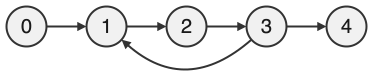

<div class="circle-ol" markdown>

1. Il s'agit d'un graphe **orienté** car chaque arc a un sens qui représente une dépendance entre deux tâches.

2.  * f puis g : **Oui**
    * g puis f : **Non**
    * i puis j : **Oui**
    * j puis i : **Oui**

3. Il faut avoir réalisé les tâches **a, h, c, i et j** pour pouvoir réaliser la tâche k.

4. **Non**, ce graphe ne contient pas de cycle. 

5. Un ordre possible serait **0, 2, 1, 3, 5, puis 4**. Il s'agit d’un ordre topologique.

6. { .center-img }

7. **Non**, il n'existe pas d'ordre permettant de réaliser les tâches de ce graphe, car il contient un **cycle**, à savoir 1 — 2 — 3. Ce cycle crée une dépendance circulaire : chaque tâche dépend d’une autre dans la boucle, donc aucune ne peut être réalisée en premier.

8. La variable `ok` contient `False` à l'issue de ces instructions.

    |                     Appel `mystere`                     |     `ouverts`      |      `fermes`      |
    | :-----------------------------------------------------: | :----------------: | :----------------: |
    |                 Avant l’appel `mystere`                 | `#!py [F,F,F,F,F]` | `#!py [F,F,F,F,F]` |
    | `#!py mystere(M, 1, 5, [F,F,F,F,F], [F,F,F,F,F], None)` | `#!py [F,T,F,F,F]` | `#!py [F,F,F,F,F]` |
    | `#!py mystere(M, 2, 5, [F,T,F,F,F], [F,F,F,F,F], None)` | `#!py [F,T,T,F,F]` | `#!py [F,F,F,F,F]` |
    | `#!py mystere(M, 3, 5, [F,T,T,F,F], [F,F,F,F,F], None)` | `#!py [F,T,T,T,F]` | `#!py [F,F,F,F,F]` |
    | `#!py mystere(M, 1, 5, [F,T,T,T,F], [F,F,F,F,F], None)` | `#!py [F,T,T,T,F]` | `#!py [F,F,F,F,F]` |

9. Cette fonction renvoie `False` si et seulement **s'il existe un cycle** à partir du sommet `s`.

10. Après exécution de ces instructions, la variable `elt` contient **2**.

11. 
```python
resultat.empiler(s)  # à la ligne 24
```

</div>
