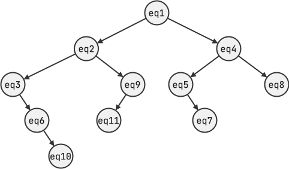
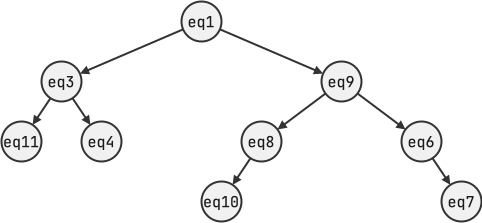

<!--NAVIGATION_START-->
<div class="center-button" markdown>
[:material-arrow-left:](24-NSIJ1ME1-2.md){ .md-button .nav-button }
[:fontawesome-solid-file-pdf: &nbsp; Énoncé](../exercices/24-NSIJ1ME1-3.pdf){ .md-button }
[:fontawesome-solid-file-pdf: &nbsp; Sujet](../sujets/24-NSIJ1ME1.pdf){ .md-button }
[:material-home:](../index.md/#sujets-2024){ .md-button .nav-button }
</div>
<!--NAVIGATION_END-->

<div class="circle-ol" markdown>

1. `#!py chien40 = Chien(40, 'Duke', 'wheel dog', 10)`

2. 
```python
def changer_role(self, nouveau_role):
    self.role = nouveau_role
```

3. `#!py chien40.changer_role('leader')`

4. 
```python
def retirer_chien(self, numero):
    for i in range(len(self.liste_chiens)):
        if liste_chiens[i].id_chien == numero:
            self.liste_chiens.pop(i)
            return
```

5. `#!py e11.retirer_chien(46)`

6. L'expression `#!py convert('4h36')` renvoie 4 + 36 / 60 = **4.6**.

7. 
```python
def temps_course(equipe):
    total = 0
    for temps in equipe.liste_temps:
        total = total + convert(temps)
    return total
```

8. { .center-img width="350px" }

9. Le **parcours infixe** permet d’obtenir la liste des équipes classées de
la plus rapide à la plus lente. En effet, le parcours infixe permet de considérer les noeuds dans un Arbre Binaire de Recherche (ABR) par ordre croissant.

10. La fonction `inserer` est récursive car elle s’appelle elle-même (ligne 8 et 13).

11. 
```python hl_lines="4 6 11"
def inserer(arb, eq):
    if convert(eq.temps_etape) < convert(arb.racine.temps_etape):
        if arb.gauche is None:
            arb.gauche = Noeud(eq)
        else:
            inserer(arb.gauche, eq)
    else:
        if arb.droit is None:
            arb.droit = Noeud(eq)
        else:
            inserer(arb.droit, eq)
```

12. 
```python hl_lines="3 5"
def est_gagnante(arbre):
    if arbre.gauche == None:
        return arbre.racine.nom_equipe
    else:
        return est_gagnante(arbre.gauche)
```

13. { .center-img width="350px"}

14. 
```python
def rechercher(arbre, equipe):
    if arbre is None: # cas de base
        return False
    if arbre.racine == equipe: # cas de base
        return True

    # on va à gauche ou à droite suivant le temps du noeud courant
    if convert(equipe.temps_etape) < convert(arbre.racine.temps_etape):
        return rechercher(arbre.gauche, equipe)
    else:
        return rechercher(arbre.droit, equipe)
```

</div>