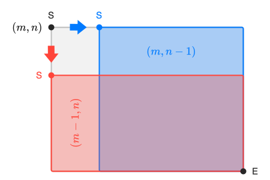

<div class="circle-ol" markdown>

1.  * `itineraire` est un **attribut** de la classe `Chemin`
    * `remplir_grille` est une **méthode** de la classe `Chemin`

2. Les variables `a` et `b` contiennent respectivement les valeurs **4** et **7**. Le sujet présente une petite coquille, il faut corriger `#!py a = chemin_1.largueur` en `#!py a = chemin_1.largeur`.

3. 
```python hl_lines="4 6 8"
def remplir_grille(self):
    i, j = 0, 0
    self.grille[0][0] = 'S'
    for direction in self.itineraire:
        if direction == 'D':
            j += 1
        elif direction == 'B':
            i += 1
        self.grille[i][j] = '*'
    self.grille[self.largeur][self.longueur] = 'E'
```

4. 
```python
def get_dimensions(self):
    return (self.longueur, self.largeur)
```

5. 
```python
def tracer_chemin(self):
    self.remplir_grille()
    chaine = ''
    for ligne in self.grille:
        for case in ligne:
            chaine += case + ' '
        chaine += '\n'
    print(chaine)
```

    Ou pour ceux qui apprécient le beau code :

    ```python
    def tracer_chemin(self):
        self.remplir_grille()
        print('\n'.join(map(' '.join, self.grille)))
    ```

6. 
```python hl_lines="7 8 9 10 11 12"
from random import choice

def itineraire_aleatoire(m, n):
    itineraire = ''
    i, j = 0, 0
    while i != m and j != n:  # : oublié
        deplacement = choice('BD')  # ou choice(['B', 'D'])
        itineraire += deplacement
        if deplacement == 'D':
            j += 1
        else:
            i += 1
    if i == m:
        itineraire = itineraire + 'D' * (n - j)
    if j == n:
        itineraire = itineraire + 'B' * (m - i)
    return itineraire
```

7. Pour un itinéraire de dimension $1 × n$, il n'y qu'un seul sens de déplacement possible, aller à droite. Il n'existe donc qu'un seul chemin $\underbrace{\texttt{DDD} \ldots \texttt{D}}_{n \text{ fois}}$. Ainsi, $\boxed{N(1, n) = 1}$.

8. Dans une grille de taille $m \times n$, le premier déplacement est au choix :

    * Aller à droite, il reste alors à parcourir un chemin dans une grille de taille $m \times n - 1$.
    * Aller en bas, il reste alors à parcourir un chemin dans une grille de taille $m-1 \times n$.

    { .center-img width="400px"}

    Le nombre total de chemins possibles est donc la somme des chemins possibles dans ces deux cas, d'où la relation $\boxed{N(m, n) = N(m, n - 1) + N(m - 1, n)}$.


9.  
```python
def nombre_chemins(m, n):
    if m == 1 or n == 1:
        return 1
    return nombre_chemins(m - 1, n) + nombre_chemins(m, n - 1)
```

</div>
