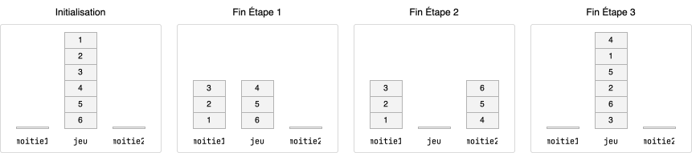

<div class="circle-ol" markdown>

1. 

2. 
```python hl_lines="3 4"
def produire_jeu(n):
    resultat = Pile()
    for i in range(n):
        resultat.empile(n - i)
    return resultat
```

3. 
```python hl_lines="3 4 6"
def scinder_jeu(p, n):
    m1 = Pile()
    m2 = Pile()
    for i in range(n // 2):
        m1.empile(p.depile())
    for i in range(n // 2):
        m2.empile(p.depile())
    return m1, m2
```

4. 
```python
def recombiner(m1, m2):
    jeu = Pile()
    while not m1.est_vide():
        jeu.empile(m1.depile())
        jeu.empile(m2.depile())
    return jeu
```

5. 
```python
def faro(jeu, n):
    m1, m2 = scinder_jeu(jeu, n)
    return recombiner(m1, m2)
```

6. 
```python
# piles différentes, mais de même taille
p1 = Pile()
p2 = Pile()
p1.empiler(1)
p2.empiler(2)
assert not identiques(p1, p2)

# piles identiques
p1 = Pile()
p2 = Pile()
p1.empiler(1)
p2.empiler(1)
assert identiques(p1, p2)
```

7. 
```python
def ordre_faro(n: int) -> int:
    jeu_initial = produire_jeu(n)
    jeu_courant = faro(produire_jeu(n), n)
    nb_melanges = 1
    while not identiques(jeu_courant, jeu_initial):
        jeu_courant = faro(jeu_courant, n)
        nb_melanges += 1
    return nb_melanges
```
</div>