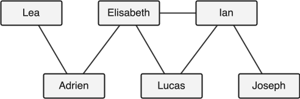
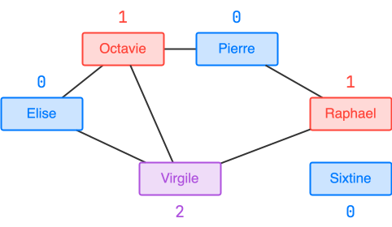

<div class="circle-ol" markdown>

1. L'attribut `annee` est de type **entier** (`INT`).

2. Puisque les enfants ont entre 0 et 18 ans, leur année de naissance doit respecter, en notant $A$ l'année en cours :
    $$
    A - 18 \leq \texttt{annee} \leq A
    $$

    Si $A = 2025$ alors une contrainte de domaine pertinente serait $2007 \leq \texttt{annee} \leq 2025$.

3. L'attribut `num_parent` est soumis à une contrainte de référence car il est une clé étrangère, plus précisément il fait référence à la clé primaire `tel` de la table `parent`.

4. Puisqu'on ne considère qu'un seul parent par élève, chaque parent peut être identifié de manière unique grâce à son numéro de téléphone. L'attribut `tel` est donc une clé primaire pertinente pour la table `parent`.

5. Une clé étrangère doit toujours correspondre à une clé primaire existante. Modifier directement la clé primaire (`tel`) d’un parent pourrait rendre invalide la référence à ce parent dans la table `enfant`, ce qui explique l’erreur levée par la requête.

6. 
```sql
INSERT INTO parent VALUES ('Bauges', 33619782812, 73340);
UPDATE enfant SET num_parent = 33619782812 WHERE num_parent = 33600782812;
DELETE FROM parent WHERE tel = 33600782812;
```

7. Cette requête renvoie :

    | `prénom` |
    | :------: |
    | Nakamura |
    |   Hawa   |
    |   Kian   |
    |  Adrien  |

8. 
```sql
SELECT prenom
FROM enfant
WHERE num_parent = 3319861122 
ORDER BY prenom;
```

9.  
```sql
SELECT enfant.id, enfant.prenom
FROM enfant
JOIN parent ON parent.tel = enfant.num_parent
WHERE parent.codep = 38520;
```

10. Il n'y a aucune nécessité à orienter les arêtes, car la mésentente est une relation réciproque, elle concerne toujours les deux enfants. Un graphe non orienté est donc suffisant.

2. { width="400px" .center-img }

3.  
```python
def degre(g, s):
    return len(g[s])
```

1.  
```python hl_lines="7 8 9 10"
def sommets_tries(g):
    sommets = [sommet for sommet in g]
    n = len(sommets)
    for i in range(1, n):
        sommet_courant = sommets[i]
        j = i - 1
        while j >= 0 and degre(g, sommets[j]) < degre(g, sommet_courant):
            sommets[j + 1] = sommets[j]
            j = j - 1
        sommets[j + 1] = sommet_courant
    return sommets
```

1.  La fonction `sommets_tries` utilise un **tri par insertion** de coût $O(n^2)$ dans le pire des cas.

2.  { width="400px" .center-img }

3.  
```python
def colorer_graphe(g, dc):
    for s in dc:
        couleur = plus_petite_couleur_hors_voisins(g, dc, s)
        dc[s] = couleur
```

1.  
```python
def welsh_powell(g):
    dc = {s: -1 for s in g}
    for s in sommets_tries(g):
        couleur = plus_petite_couleur_hors_voisins(g, dc, s)
        dc[s] = couleur
    return dc
```

</div>