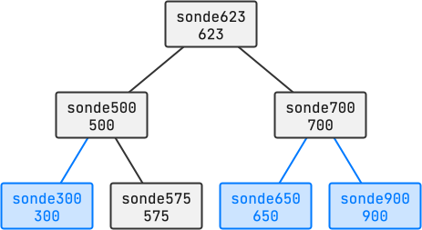

<!--NAVIGATION_START-->
<div class="center-button" markdown>
[:material-arrow-left:](25-NSIJ1G11-2.md){ .md-button .nav-button }
[:fontawesome-solid-file-pdf: &nbsp; Énoncé](../exercices/25-NSIJ1G11-3.pdf){ .md-button }
[:fontawesome-solid-file-pdf: &nbsp; Sujet](../sujets/25-NSIJ1G11.pdf){ .md-button }
[:material-home:](../index.md/#sujets-2025){ .md-button .nav-button }
</div>
<!--NAVIGATION_END-->

<div class="circle-ol" markdown>

1. L'expression `#!py enregistrement['latitude']` renvoie la valeur souhaitée `#!py 38.28825`.

2. Cet appel renvoie `#!py ('2024-06-27', '23:36:01')`.

3. L'expression `#!py len(frames)` renvoie `#!py 4` et `#!py len(frames[1])` renvoie `#!py 5`.

4. 
```python
def detecter_anomalie(enregistrement):
    return not (0 <= enregistrement['altitude'] <= 35000)
```

5. 
```python
def liste_num_serie(frames):
    nums = []
    for enregistrement in frames:
        num = enregistrement['num_serie']
        if num not in nums:
            nums.append(num)
    return nums
```

6. 
```python hl_lines="3 4"
def distance_total(dep):
    total = 0
    for i in range(len(dep) - 1):
        total += distance_haversine(dep[i], dep[i + 1])
    return total
```

7. 
```python
Sonde(623, 38.38825, 27.09004, '2024-06-27', None, None)
```

8. { .center-img width="350px" }

9. Le **parcours infixe** permet de lire les numéros des sondes dans l'ordre croissant des numéros de série.

10. 
```python hl_lines="3 4 7"
def rechercher(self, numero):
    if self.est_vide():
        return None
    if numero == self.num_serie:
        return self
    elif numero < self.num_serie:
        return self.gauche.rechercher(numero)
    else:
        return self.droit.rechercher(numero)
```

11. La méthode `rechercher` est récursive car **elle s'appelle elle-même** (ligne 7 et 9).

12. L'attribut `id_abonne` permet d'identifier de manière unique chaque enregistrement de la table `abonne`, il peut donc servir de clé primaire.

13. Dans la table `info_recuperation`, les clés étrangères sont :
    
    * L'attribut `id_abonne` qui fait référence à la clé primaire `id_abonne` de la table `abonne`.
    * L'attribut `num_serie` qui fait référence à la clé primaire `num_serie` de la table `sonde`.

14. 
|  `nom`  | `prenom` |
| :-----: | :------: |
| Détoile |  Diane   |
| Girard  | Antoine  |

15. 
```sql
INSERT INTO InfosRecuperation
VALUES (14, 480, 24, '2024-07-10', 47.230, 12.244);
```

16. 
```sql
SELECT num_serie, nom, date_recup
FROM info_recuperation
JOIN abonne ON abonne.id_abonne = info_recuperation.id_abonne;
```

</div>
