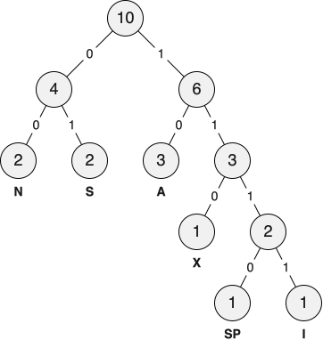

<!--NAVIGATION_START-->
<div class="center-button" markdown>
[:material-arrow-left:](25-NSIJ1JA1-1.md){ .md-button .nav-button }
[:fontawesome-solid-file-pdf: &nbsp; Énoncé](../exercices/25-NSIJ1JA1-2.pdf){ .md-button }
[:fontawesome-solid-file-pdf: &nbsp; Sujet](../sujets/25-NSIJ1JA1.pdf){ .md-button }
[:material-arrow-right:](25-NSIJ1JA1-3.md){ .md-button .nav-button }
</div>
<!--NAVIGATION_END-->

<div class="circle-ol" markdown>

1. La chaîne `#!py 'SIX ANANAS'` se compose de 10 caractères, elle nécessite donc $10 \times 8 = \boxed{80}$ **bits** de stockage.

2. La chaîne est codé en hexadécimal comme **`53 49 58 20 41 4E 41 4E 41 53`**.

3. 
|  SP   |   A   |   I   |   N   |   S   |   X   |
| :---: | :---: | :---: | :---: | :---: | :---: |
|   1   |   3   |   1   |   2   |   2   |   1   |

4. La somme des nombres d'occurrences correspond au **nombre total de caractères** du texte étudié.

5. 
```python hl_lines="3 4 7 8"
def occurrence(texte):
    dico = {}
    for lettre in texte:
        if lettre in dico:
            dico[lettre] = dico[lettre] + 1
        else:
            dico[lettre] = 1
    return dico
```

6. { .center-img } Il est à noter que plusieurs arbres sont possibles, car il est possible d'intervertir les feuilles de même poids et d'échanger, pour chaque nœud, les sous-arbres gauche et droite. 

7. Le poids de la racine de cet arbre correspond au **nombre total de caractères** du texte étudié.

8. Il s'agit d'un **parcours en profondeur**.

9. 
|      SP       |      A      |       I       |      N      |      S      |      X       |
| :-----------: | :---------: | :-----------: | :---------: | :---------: | :----------: |
| <tt>1110</tt> | <tt>10</tt> | <tt>1111</tt> | <tt>00</tt> | <tt>01</tt> | <tt>110</tt> |

10. **Chaque caractère est codé par un nombre variable de bits**, par exemple <tt>A</tt> est codé sur 2 bits, tandis que <tt>I</tt> est codé sur 4 bits. Le code de Huffman est donc un code de longueur variable.

11. Suivant l'arbre de Hufmann construit à la question 6, la chaîne `#!py 'SIX ANANAS'` se code sur 25 bits comme **`0111111101110100010001001`**.

12. Le taux de compression est ici de $\frac{80 - 25}{80} \approx \boxed{69\%}$, ce qui vérifie bien l'assertion du texte d'introduction.

</div>
