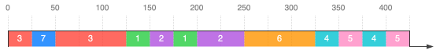

<!--NAVIGATION_START-->
<div class="center-button" markdown>
[:material-arrow-left:](25-NSIJ1ME1-1.md){ .md-button .nav-button }
[:fontawesome-solid-file-pdf: &nbsp; Énoncé](../exercices/25-NSIJ1ME1-2.pdf){ .md-button }
[:fontawesome-solid-file-pdf: &nbsp; Sujet](../sujets/25-NSIJ1ME1.pdf){ .md-button }
[:material-arrow-right:](25-NSIJ1ME1-3.md){ .md-button .nav-button }
</div>
<!--NAVIGATION_END-->

<div class="circle-ol" markdown>

1. 
```python
tache1 = Tache(1, 'Répondre aux e-mails', 45)
tache2 = Tache(2, 'Ranger sa chambre', 60)
```

2. 
```python
def avancer(self, n):
    self.duree_restante -= n
```

3. 
```python
def est_terminee(self):
    return self.duree_restante <= 0
```

4. <tt style="font-size: .8em">[début] (&lt;t3&gt;, 4) <span class="hl-blue" markdown>**(&lt;t7&gt;, 4)**</span> (&lt;t1&gt;, 3) (&lt;t2&gt;, 3) <span class="hl-blue" markdown>**(&lt;t6&gt;, 2)**</span> (&lt;t4&gt;, 1) (&lt;t5&gt;, 1) [fin]</tt>

5. L'instruction `#!py f.defiler()[0]` renvoie **`<t3>`** et modifie ainsi la file :

    <tt style="font-size: .8em">[début] (&lt;t1&gt;, 3) (&lt;t2&gt;, 3) (&lt;t4&gt;, 1) (&lt;t5&gt;, 1) [fin]</tt>

6. L'instruction `#!py f.examiner()[1]` renvoie **`#!py 4`** sans modifier la file :

    <tt style="font-size: .8em">[début] (&lt;t3&gt;, 4) (&lt;t1&gt;, 3) (&lt;t2&gt;, 3) (&lt;t4&gt;, 1) (&lt;t5&gt;, 1) [fin]</tt>

7. 
```python
def ajouter_file_prio(f, t, p):
    f_aux = File()
    while not f.est_vide() and f.examiner()[1] >= p:
        f_aux.enfiler(f.defiler())
    f_aux.enfiler((t, p))
    while not f.est_vide():
        f_aux.enfiler(f.defiler())
    while not f_aux.est_vide():
        f.enfiler(f_aux.defiler())
```

8. Si la classe `File` est correctement implémentée avec des opérations `defiler` et `enfiler` en temps constant $O(1)$, puisque chaque élément de la file `f` est enfilé et défilé deux fois, alors le coût d'exécution temporel de `ajouter_file_prio` est en $\boxed{O(m)}$ où $m$ est le nombre d'éléments dans `f`.

9.  { .center-img }

10. 
```python
def planning(f):
    liste_taches = []
    while not f.est_vide():
        t, p = f.defiler()
        liste_taches.append(t)
        t.avancer(25)
        if not t.est_terminee():
            ajouter_file_prio(f, t, p)
    return liste_taches
```

</div>
