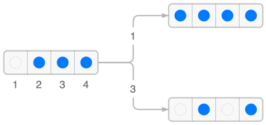
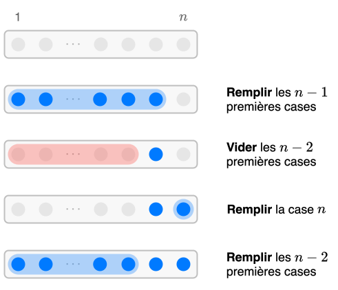

<!--NAVIGATION_START-->
<div class="center-button" markdown>
[:material-arrow-left:](25-NSIJ1PO1-1.md){ .md-button .nav-button }
[:fontawesome-solid-file-pdf: &nbsp; Énoncé](../exercices/25-NSIJ1PO1-2.pdf){ .md-button }
[:fontawesome-solid-file-pdf: &nbsp; Sujet](../sujets/25-NSIJ1PO1.pdf){ .md-button }
[:material-arrow-right:](25-NSIJ1PO1-3.md){ .md-button .nav-button }
</div>
<!--NAVIGATION_END-->

<div class="circle-ol" markdown>

1. Il est possible de jouer la case 1 et 3 :
   { .center-img width="350px" }

2. 
```python
def initialiser(n):
    return [False] * n
```

3. 
```python
def victoire(tab):
    for etat_case in tab:
        if etat_case == False:
            return False
    return True
```

4. 
```python
def indice_premiere_case_occupee(tab):
    for i in range(len(tab)):
        if tab[i]:
            return i
    return None
```

5. 
```python
def coup_valide(tab, case):    
    return 0 <= case < len(tab) and (case == 0 or \ 
        case == indice_premiere_case_occupee(tab) + 1)
```

6. 
```python
def changer_case(tab, case):
    if coup_valide(tab, case):
        tab[case] = not tab[case]
    return tab
```

7. 
```python
print('Vider case', n)
```

8. 
```pycon
>>> vider(3)
Vider case 1
Vider case 3
Remplir case 1
Vider case 2
Vider case 1
```

9. 
```python
def remplir(n):
    if n == 1:
        print('Remplir case 1'):
    elif n > 1:
        remplir(n - 1)
        vider(n - 2)
        print('Remplir case', n)
        remplir(n - 2)
```
    Le processus est le suivant :

    { .center-img width="350px" }

1. Puisque la fonction `vider` s'appelle elle-même deux fois, elle est de complexité exponentielle suivant la taille du baguenaudier. Elle devient donc trop lente dès que cette taille devient un peu trop grande.

</div>
