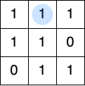

<!--NAVIGATION_START-->
<div class="center-button" markdown>
[:material-home:](../index.md/#sujets-2025){ .md-button .nav-button }
[:fontawesome-solid-file-pdf: &nbsp; Énoncé](../exercices/25-NSIJ2AN1-1.pdf){ .md-button }
[:fontawesome-solid-file-pdf: &nbsp; Sujet](../sujets/25-NSIJ2AN1.pdf){ .md-button }
[:material-arrow-right:](25-NSIJ2AN1-2.md){ .md-button .nav-button }
</div>
<!--NAVIGATION_END-->

<div class="circle-ol" markdown>

1. Le caractère <tt>a</tt> est représenté par l'octet $97 = 64 + 32 + 1 = \texttt{01100001}$.

2. L'appel `#!py replique([0, 0, 1, 0, 1])` renvoie la liste `#!py [0, 0, 0, 0, 0, 0, 1, 1, 1, 0, 0, 0, 1, 1, 1]`.

3. 
```python hl_lines="6 8"
def nb_occurrences(tab, i):
    nb_occ = {}
    for j in range(3 * i, 3 * (i + 1)):
        x = tab[j]
        if x in nb_occ:
            nb_occ[x] += 1
        else:
            nb_occ[x] = 1
    return nb_occ
```

4. 
```python hl_lines="5 6 7"
def majorite(dict):
    cle_max = None
    valeur_max = -1
    for cle in dict.keys():
        if dict[cle] > valeur_max:
            valeur_max = dict[cle]
            cle_max = cle
    return cle_max
```

5. { .center-img }

6. 
```python
def erreur_colonne(mat):
    for colonne in range(len(mat[0])):
        total = 0
        for ligne in range(len(mat)):
            total += mat[ligne][colonne]
        if total % 2 != 0:  
            return colonne
    return None  # aucune erreur rencontrée
```

7. Puisque que le mot `10100000` diffère seulement d'un bit du mot `11100000`, le mot de 4 bits initial est `1000`.

8. 
```python hl_lines="6 8 12"
hamming_4_7 = [ ... ]
def corriger_erreur(code_recu):
    if code_recu in hamming_4_7:
        return code_recu
    else:
        code = [bit for bit in code_recu]
        for indice in range(7):
            code[indice] = (code[indice] + 1) % 2
            if code in hamming_4_7:
                return code
            else:
                code[indice] = code_recu[indice] # ou (code[indice] + 1) % 2
```

9. Dans l'arbre décodeur complet du code de Hamming $(4, 7)$, tous les mots de 7 bits correspondent à un chemin unique vers une feuille. Il y a donc $2^7 = 128$ feuilles dans cet arbre.

10. 
```python hl_lines="5 7"
def decode(arbre, code, i):
    if i == len(code):
        return arbre.etiquette
    if code[i] == 0:  # descendre à gauche
        return decode(arbre.gauche, code, i + 1)
    if code[i] == 1:  # descendre à droite
        return decode(arbre.droit, code, i + 1)
```
</div>