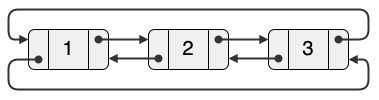

<!--NAVIGATION_START-->
<div class="center-button" markdown>
[:material-arrow-left:](25-NSIJ2AN1-1.md){ .md-button .nav-button }
[:fontawesome-solid-file-pdf: &nbsp; Énoncé](../exercices/25-NSIJ2AN1-2.pdf){ .md-button }
[:fontawesome-solid-file-pdf: &nbsp; Sujet](../sujets/25-NSIJ2AN1.pdf){ .md-button }
[:material-arrow-right:](25-NSIJ2AN1-3.md){ .md-button .nav-button }
</div>
<!--NAVIGATION_END-->

<div class="circle-ol" markdown>

1. Dans le cas où le collier possède 8 bonbons, Bob les mange dans l'ordre **0 — 3 — 6 — 2 — 7 — 5 — 1**. Le bonbon restant est celui d'indice **4**.

2. Une erreur de type `NameError` signifie que l'on utilise un nom (variable ou fonction) qui n'a pas été défini ou initialisé. Ici, Bob a écrit `true` au lieu de `#!py True`.

3. 
```python hl_lines="2 7 9 11 13"
def dernier(n):
    collier = [True for i in range(n)]
    indice = 0
    collier[indice] = False
    for etape in range(n - 1):
        nb_bonbons_vus = 0
        while nb_bonbons_vus < 3:
            indice += 1
            if indice >= n:
                indice = 0
            if collier[indice]:
                nb_bonbons_vus += 1
        collier[indice] = False
    return indice
```

4. Une file est une structure de données **FIFO**.

5. Ces instructions affichent `(Tête) 3 4 1 2 (Queue)`.

6. 
```python
def dernier_file(n):
    f = File()
    for i in range(n):
        f.enfile(i)
    for etape in range(n - 1):
        f.defile()
        f.enfile(f.defile())
        f.enfile(f.defile())
    return f.defile()
```

7. Ces variables sont les **attributs** des objets de la classe `Bonbon`.

8. La variable `a` contient 1 et la variable `b` contient 2.

9. 
```python hl_lines="5 6 7 9 10"
def creer_collier(n):
    premier = Bonbon(0)
    actuel = premier
    for i in range(1, n):
        nouveau = Bonbon(i)
        actuel.succ = nouveau
        nouveau.pred = actuel
        actuel = nouveau
    actuel.succ = premier
    premier.pred = actuel
    return premier
```

10. Somme toute, ces instructions suppriment le premier chaînon de la liste : { .center-img }

11. Seule la **proposition C** s'évalue à `#!py True`, la syntaxe des autres propositions est erronée.

12. 
```python hl_lines="3 4 5 6"
def dernier_chaine(n):
    bonbon = creer_collier(n)
    while bonbon.valeur != bonbon.succ.valeur:  # question 11
        bonbon.pred.succ = bonbon.succ  # question 10
        bonbon.succ.pred = bonbon.pred  # question 10
        bonbon = bonbon.succ.succ.succ  # décalage de 3 bonbons
    return bonbon.valeur
```
</div>