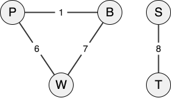

<div class="circle-ol" markdown>

1. Plusieurs passagers peuvent réserver le même vol, donc l'attribut `id_vol` ne peut à lui seul identifier de manière unique une réservation d'un passager.

2. Le couple `(id_vol, id_passager)` peut être utilisé comme une clé primaire. En effet, `id_passager` n'est pas suffisant car un passager pourrait réserver plusieurs vols (typiquement une correspondance).

3. Une clé étrangère fait référence à une clé primaire d'une autre relation.

4. Cette requête renvoie tous les identifiants des vols dont l'aéroport d'arrivé est CDG, plus précisement l'aéroport Charles de Gaulle à Paris. Suivant la table donnée en exemple, cette requête renvoie :
   
    | `id_vol` |
    | :------: |
    |  AI0015  |
    |  AI0258  |
    |  AI0292  |

5. 
```sql
SELECT DISTINCT aeroport.ville
FROM aeroport
JOIN vol ON vol.aeroport_arr = aeroport.id_aeroport
WHERE vol.aeroport_dep = "CDG";
```

6. 
```sql
UPDATE passager
SET d_totale = 16
WHERE id_passager = 5;
```

7. L'`id_vol` AI0256 est déjà utilisé, or cet attribut est utilisé comme clé primaire de la relation `vol`, cela aboutit donc à une erreur. Il suffit de choisir un `id_vol` non-utilisé comme AI9999.

8.  L'expression `#!py graphe_airinfo['T']['P']` renvoie `#!py 10`.

9. 
```python
def vol_direct(graphe, ville1, ville2):
    return ville2 in graphe[ville1]
```

10. 
```python
def liste_villes_proches(graphe, ville, d_max):
    return [v for v, d in graphe[ville].items() if d <= d_max]
```
    Ou plus simplement :
```python
def liste_villes_proches(graphe, ville, d_max):
    villes = []
    for v in graphe[ville]:
        d = graphe[ville][v]
        if d <= d_max:
            villes.append(v)
    return villes
```

11. { .center-img }

12. Seule la **proposition A** est correcte.

13. La fonction `parcours` est récursive parce qu'**elle s'appelle elle-même** à la ligne 12.

14. À la fin de l'exécution :
    * `visitees1` contient `#!py ['W', 'P', 'T', 'B', 'S']`
    * `visitees2` contient `#!py ['W', 'P', 'B']`.

15. La fonction `parcours` repose sur un parcours en profondeur récursif, donc **proposition C**.

16. 
```python
def est_connexe(graphe):
    depart = ville_arbitraire(graphe)
    visitees = []
    parcours(graphe, visitees, depart)
    return len(visitees) == len(graphe)
```

17.  L'appel `#!py mystere(graphe_airinfo, 'W', [], 0, 'B')` affiche :
```
['W', 'P', 'T', 'B'] 25
```

18. Plus généralement, cette fonction effectue un **parcours en profondeur** à partir de la ville de départ `ville`. Elle explore récursivement les villes voisines jusqu’à atteindre la ville `arrivee` et afficher le chemin parcouru et sa distance totale.

    Cependant, puisqu'il s’agit d’un parcours en profondeur, il peut s’engager dans un cul-de-sac et revenir en arrière pour explorer d’autres branches du graphe. Le chemin affiché n’est donc pas garanti comme un itinéraire réalisable sans rebroussement. Autrement dit, cette fonction ne fournit pas nécessairement un plan de vol valide, à moins qu'un avion puisse se téléporter. Auquel cas, il suffit de se téléporter directement à `arrivee` 😄

</div>