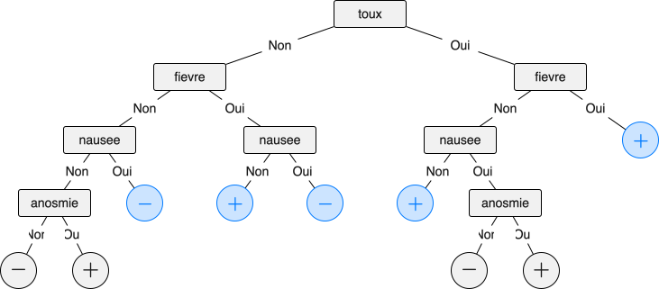

<!--NAVIGATION_START-->
<div class="center-button" markdown>
[:material-arrow-left:](25-NSIJ2JA1-2.md){ .md-button .nav-button }
[:fontawesome-solid-file-pdf: &nbsp; Énoncé](../exercices/25-NSIJ2JA1-3.pdf){ .md-button }
[:fontawesome-solid-file-pdf: &nbsp; Sujet](../sujets/25-NSIJ2JA1.pdf){ .md-button }
[:material-home:](../index.md/#sujets-2025){ .md-button .nav-button }
</div>
<!--NAVIGATION_END-->

<div class="circle-ol" markdown>

1. 
```sql
SELECT nom_patient, prenom
FROM Patient
WHERE age > 60;
```

2. 
```sql
UPDATE Symptome
SET toux = 'Non'
WHERE nom_patient = 'Heartman';
```

3. 
```sql
SELECT COUNT(*)
FROM Diagnostic
JOIN Symptome ON Symptome.nom_patient = Diagnostic.nom_patient
WHERE nom_maladie = 'Covid-19' and toux = 'Oui';
```

4. Cette requête renvoie une erreur car elle tente d'insérer un nouvel enregistrement dont la valeur de la clé primaire (`#!sql 'Douglas'`) est déjà présente dans la table `Patients`. Or, une clé primaire doit identifier chaque enregistrement de manière unique : deux enregistrements ne peuvent partager la même valeur de clé primaire.

5. Puisque le numéro de sécurité sociale est unique pour chaque individu, il est naturel de l'utiliser comme clé primaire. Ainsi le schéma relationnel de `Patient` devient :

    <center><tt style="font-size: .85em">Patient(<u>numero_secu</u>: INT, nom_patient: TEXT, prenom: TEXT, age: INT)</tt></center>

6. D'après l'arbre, ce patient est diagnostiqué **positif**.

7. **L'assertion dans la méthode symptome provoque une erreur si on l'applique à une feuille de l'arbre**, car une feuille représente un diagnostic et non un potentiel symptôme. Elle sert à garantir que cette méthode n'est appelée que sur un nœud interne.

8. Dans la classe `Noeud`, `valeur` est un attribut et `est_feuille` est une méthode.

9. 
```python hl_lines="3 6 8"
def applique(arbre, patient):
    if arbre.est_feuille():
        return arbre.diagnostic()
    else:
        if patient[arbre.symptome()]:
            return applique(arbre.droit, patient)
        else:
            return applique(arbre.gauche, patient)
```

10. La taille de l'arbre de la figure 1 est $1 + 2 + 4 + 8 + 16 = \boxed{31}$. 

11. { .center-img }

12. 
```python hl_lines="5 6 7 8 9 10"
def reduire(self):
    if self.est_feuille():
        return
    self.gauche.reduire()
    self.droite.reduire()
    if self.gauche.est_feuille() and self.droite.est_feuille() \ 
       and self.gauche.valeur == self.droite.valeur:
        self.valeur = self.gauche.valeur
        self.gauche = None
        self.droite = None
```

13. 
```python hl_lines="4"
def verifie(num_secu):
    n = num_secu // 100
    k = num_secu % 100
    return (n + k) % 97 == 0
```

14. 
```python
def cle(n):
    for k in range(100):
        if verifie(n * 100 + k):
            return k
```

    Ou plus simplement :

    ```python
    def cle(n):
        return -n % 97
    ```


</div>
