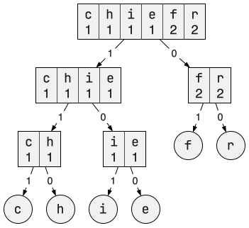

<!--NAVIGATION_START-->
<div class="center-button" markdown>
[:material-home:](../index.md/#sujets-2025){ .md-button .nav-button }
[:fontawesome-solid-file-pdf: &nbsp; Énoncé](../exercices/25-NSIJ2ME1-1.pdf){ .md-button }
[:fontawesome-solid-file-pdf: &nbsp; Sujet](../sujets/25-NSIJ2ME1.pdf){ .md-button }
[:material-arrow-right:](25-NSIJ2ME1-2.md){ .md-button .nav-button }
</div>
<!--NAVIGATION_END-->

<div class="circle-ol" markdown>

1. Le caractère « <tt style="font-size: .95em">_</tt> » est codé par le mot binaire <tt style="font-size: .95em">**010**</tt>.

2. Le texte codé est « <tt style="font-size: .95em">**espion**</tt> ».

3. Un **parcours en largeur** permettrait d'obtenir les symboles classés par taille d'encodage croissante. 

4. Le total des occurrences est identique dans les deux groupes :
$1 + 1 + 1 + 1 + 1 + 1 + 1 + 2 + 2 = \boxed{11}$ et $3 + 4 + 4 = \boxed{11}$. La séparation illustrée respecte donc bien l'étape 2 qui consiste à former deux groupes aux totaux les plus proches possibles.

1. L'arbre a ici une hauteur de **5**, soit le nombre maximum de bits utilisé pour coder un symbole.

2. * Le texte « <tt style="font-size: .95em">je pense, donc je suis</tt> » comporte 22 caractères, son codage ASCII nécessite donc 22 octets. 
    * Son codage Shannon-Fano nécessite $4 + 4 + 4 + 5 + 5 + 4 + 4 + 2 \times 4 + 2 \times 4 + 3 + 3 \times 3 + 4 \times 3 + 4 \times 2 = 78$ bits, soit 10 octets.
     
    Puisque $22 / 10 ≈ 2$, on peut affirmer que le codage Shannon-Fano necéssite pour ce texte environ deux fois moins d'octets que le codage ASCII.

3. { .center-img }

4. 
```python hl_lines="5 7"
def creer_dico_occ(texte):
    dico = {}
    for symbole in texte:
        if symbole in dico:
            dico[symbole] = dico[symbole] + 1
        else:
            dico[symbole] = 1
    return dico
```

1. 
```python
def somme_occ(tab):
    total = 0
    for symbole, nb_occ in tab:
        total += nb_occ
    return total
```

1.  
```python hl_lines="7 9"
def shannon(symbole, tab):
    if len(tab) == 1:
        return ''
    else:
        t1, t2 = separe(tab)
        if symbole in [elt[0] for elt in t1]:
            return '1' + shannon(symbole, t1)
        else:
            return '0' + shannon(symbole, t2)
```

1.  À chaque appel, le tableau `tab` est divisé par deux, et l'appel suivant porte sur une moitié plus petite (si la fonction `separe` était bien codée). On atteint nécessairement un tableau d'un seul élément, donc le cas de base : la fonction termine toujours.

2.  
```python
def encode_shannon(texte):
    dico = creer_dico_occ(texte)
    tab  = creer_tab_trie(dico)
    code = ''
    for symbole in texte:
        code += shannon(symbole, tab)
    return code
```

</div>
