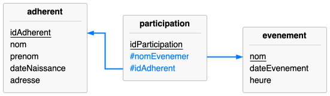

<!--NAVIGATION_START-->
<div class="center-button" markdown>
[:material-arrow-left:](25-NSIJ2ME1-1.md){ .md-button .nav-button }
[:fontawesome-solid-file-pdf: &nbsp; Énoncé](../exercices/25-NSIJ2ME1-2.pdf){ .md-button }
[:fontawesome-solid-file-pdf: &nbsp; Sujet](../sujets/25-NSIJ2ME1.pdf){ .md-button }
[:material-arrow-right:](25-NSIJ2ME1-3.md){ .md-button .nav-button }
</div>
<!--NAVIGATION_END-->

<div class="circle-ol" markdown>

1. Plusieurs adhérents peuvent partager le même nom, cet attribut ne permet donc pas d'identifier de manière unique un enregistrement de la table. Il ne peut donc pas servir de clé primaire.

2. La requête affiche le nom et l'éditeur correspondant de tous les jeux présents dans la ludothèque, triés par ordre alphabétique des noms de jeux. 

3. 
```sql
SELECT nomJeu
FROM emprunt
WHERE dateRendu IS NULL;
```

4. 
```sql
SELECT nom, prenom
FROM adherent
JOIN emprunt ON emprunt.idAdherent = adherent.idAdherent
WHERE nomJeu = 'Catan';
```

5. 
```sql
UPDATE emprunt
SET dateRendu = '2025-06-03'
WHERE idEmprunt = 1538;
```

6. 
```sql
SELECT nomJeu, categorie
FROM jeu
WHERE anneeSortie >= 2010 AND ageMinimum < 10;
```

7. { .center-img }


8. 
```python
dict_emprunts = {}
for jeu in liste:
    if jeu in dict_emprunts:
        dict_emprunts[jeu] += 1
    else:
        dict_emprunts[jeu] = 1
```

9. Bien des variantes existent, la plus « simple » me semble être :

    ```python
    def max3(dico):
        a = b = c = 0
        for n in dico.values():
            if n > a:
                a, b, c = n, a, b
            elif n > b and n != a:
                b, c = n, b
            elif n > c and n != b:
                c = n
        return [[jeu for jeu, n in dico.items() if n == m] for m in (c, b, a)]

    print(max3(dict_emprunts))
    ```

</div>
