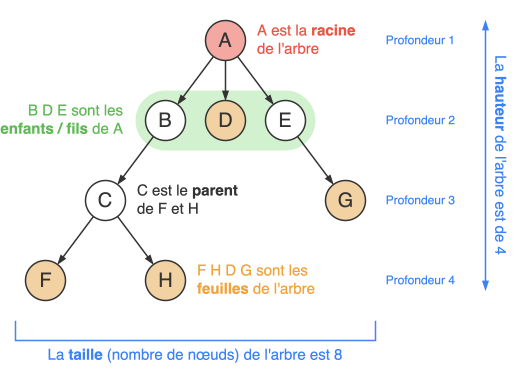
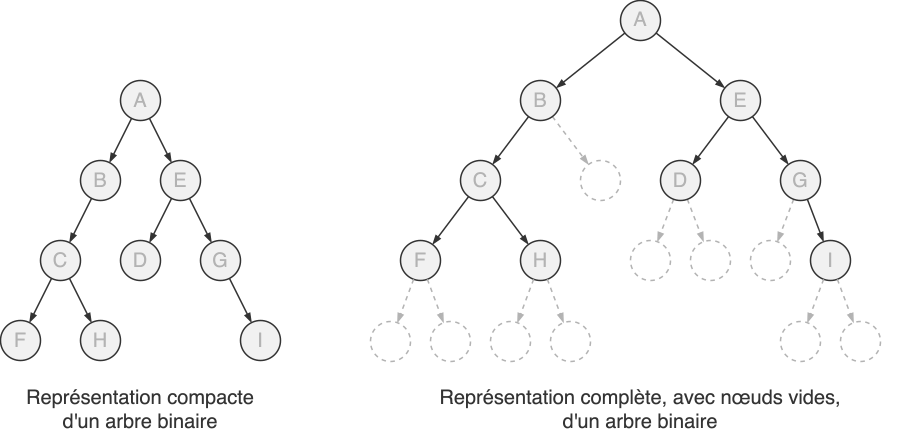
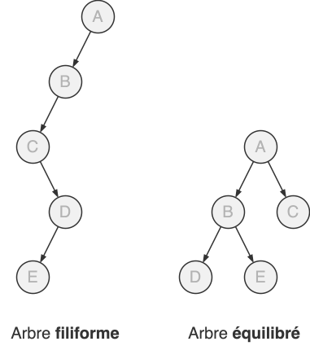
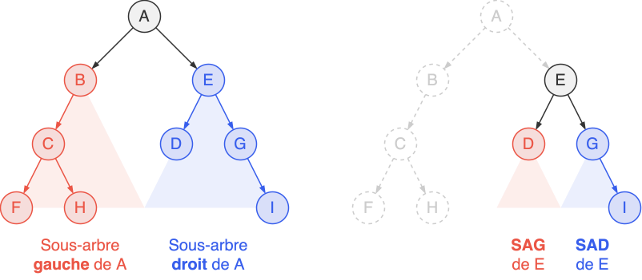
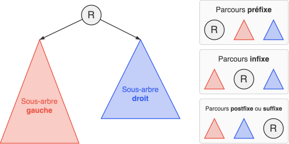
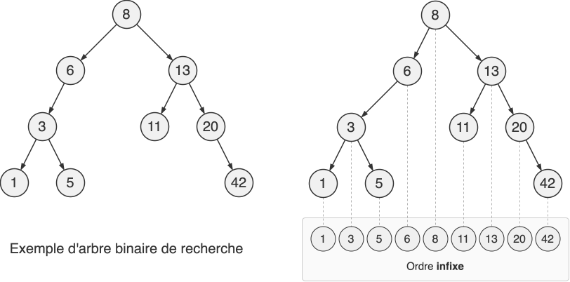

## Définitions et vocabulaire

* Un **arbre** est un graphe **connexe** et **acyclique**, il peut être orienté. C'est une structure de données **hiérarchique**.

    { width="60%" .center-img .invert }

* Attention, deux conventions pour la profondeur / hauteur coexistent. La profondeur d'un nœud est soit le nombre d'arêtes, soit le nombre de nœuds, sur le chemin de la racine à ce nœud. L'exemple utilise cette dernière convention. La hauteur est définie comme la profondeur maximale atteinte par un nœud de l'arbre.

* Un **arbre binaire** est un arbre où chaque nœud possède au plus deux fils : un fils gauche et un fils droit.

    { .center-img .invert }

* Un arbre binaire est dit **filiforme** si la hauteur est maximale et **équilibré** si la hauteur est minimale.

    { width="40%" .center-img .invert }

* Soit un arbre binaire de **taille** $n$ (son nombre de nœuds), alors sa hauteur $h$ (suivant la convention précédente) vérifie :
    $$
    \big⌈ \log_2(n + 1) \big⌉ \leq h \leq n
    $$
    On retient qu'un arbre équilibré avec $n$ noeuds a une hauteur d'environ $\log_2(n)$.

* Implémentation minimale d'un arbre binaire en Python :

    ``` { .python .no-copy }
    class Noeud:
        def __init__(self, valeur, noeugd_gauche, noeud_droit):
            self.valeur = valeur        # une valeur associée à un nœud (un nombre, une chaîne de caractères etc.)
            self.gauche = noeud_gauche  # une référence vers le nœud fils gauche. None s'il n'existe pas.
            self.droit  = noeud_droit 
    ```

* Le sous-arbre gauche (respectivement droit) d'un nœud est l'arbre dont la racine est son fils gauche (respectivement droit) :
  
    { width="80%" .center-img .invert }

* Chaque nœud d'un arbre peut être vu comme la racine d'un sous-arbre. Il est alors assez courant de confondre les notions de nœuds et d'arbres.

## Algorithmes classiques sur les arbres binaires

* La plupart des algorithmes sur les arbres binaires sont **récursifs**, car un arbre binaire est une structure de données récursive.

* La **taille** d'un arbre binaire $A$, son nombre de nœuds, peut être définie récursivement :
    $$
    \text{taille}(A) = \begin{cases}
    \ 0 & \text{si} \ A = \varnothing \newline
    \ 1 + \text{taille}(A_g) + \text{taille}(A_d)& \text{sinon}
    \end{cases}
    $$
    Où $A_g$ (resp. $A_d$) est le sous-arbre gauche (resp. droit) de A . L'implémentation en Python est alors immédiate :

    ``` { .python .no-copy }
    def taille(arbre: Noeud):
        if arbre is None:  # cas de base
            return 0
        else:
            return 1 + taille(arbre.gauche) + taille(arbre.droit)
    ```

* La **hauteur** d'un arbre binaire $A$ :
    $$
    \text{hauteur}(A)= \begin{cases}
    0 & \text{si} \ A = \varnothing \newline
    1 + \max\Big( \text{hauteur}(A_g),\ \text{hauteur}(A_d) \Big) & \text{sinon}
    \end{cases}
    $$

    ``` { .python .no-copy }
    def hauteur(arbre: Noeud):
        if arbre is None:
            return 0
        else:
            return 1 + max(hauteur(arbre.gauche), hauteur(arbre.droit))
    ```

## Parcours en profondeur d'un arbre binaire

* Il existe trois parcours en profondeur d'un arbre binaire suivant l'ordre de visite de la racine d'un arbre :

    { width="70%" .center-img .invert }

* Finalement, en terme de code, il suffit de déplacer une simple ligne de code :

    ``` { .python .no-copy }
    def parcours(arbre: Noeud):
        if arbre is not None:
            # print(arbre.valeur)   # parcours préfixe
            parcours(arbre.gauche)
            # print(arbre.valeur)   # parcours infixe
            parcours(arbre.droit)
            # print(arbre.valeur)   # parcours suffixe
    ```

* Le parcours préfixe est le parcours en profondeur « classique ».

* Le parcours infixe est utilisé pour traiter les valeurs d'un ABR dans l'ordre croissant.

## Arbres Binaires de Recherche (ABR)

* Un **Arbre Binaire de Recherche** (ABR) est un arbre binaire où la valeur (appelée **clé**) de chaque nœud est inférieure à toutes les valeurs dans son sous-arbre droit et supérieure à toutes les valeurs dans son sous-arbre gauche.

    { width="80%" .center-img .invert }

* Le parcours infixe permet de traiter les nœuds par ordre croissant.

* Sous l'hypothèse que l'arbre soit équilibré, cette structure de données permet de maintenir des valeurs triées (et donc de rechercher rapidement une valeur grâce à une recherche dichotomique) et d'insérer de manière efficiente de nouvelles valeurs. 

<div class="center-table" markdown>
|    Structure     | Complexité moyenne `insérer` | Complexité moyenne `rechercher` |
| :--------------: | :--------------------------: | :-----------------------------: |
| Tableau non-trié |            $O(1)$            |             $O(n)$              |
|   Tableau trié   |            $O(n)$            |           $O(\log n)$           |
|  ABR équilibré   |         $O(\log n)$          |           $O(\log n)$           |
</div>

<div class="grid" markdown>
``` { .python .no-copy }
def minimum(arbre: Noeud):
    if arbre is None:
        return None
    elif arbre.gauche is None:
        return arbre.valeur
    else:
        return minimum(arbre.gauche)
```

``` { .python .no-copy }
def maximum(arbre: Noeud):
    if arbre is None:
        return None
    elif arbre.droit is None:
        return arbre.valeur
    else:
        return maximum(arbre.droit)
```
</div>

``` { .python .no-copy }
def rechercher(arbre: Noeud, x):
    if arbre is None:
        return None
    elif arbre.valeur == x:
        return arbre
    elif arbre.valeur < x:
        return rechercher(arbre.gauche, x) 
    else:
        return rechercher(arbre.droit, x) 
```

``` { .python .no-copy }
def inserer(arbre: Noeud, x):
    if x < arbre.valeur:
        if arbre.gauche is None:
            arbre.gauche = Noeud(x, None, None)
        else:
            inserer(arbre.gauche, x)
    else:
        if arbre.droit is None:
            arbre.droit = Noeud(x, None, None)
        else:
            inserer(arbre.droit, x)
```