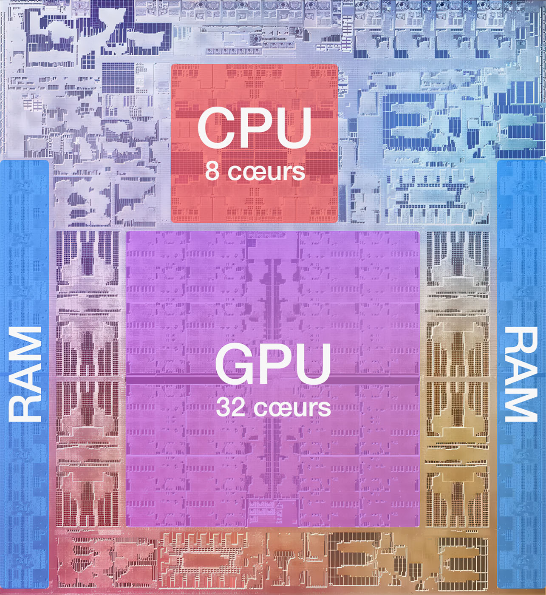

## Architecture de Von Neumann


* Le **cycle** d'une machine séquentielle se répète jusqu'à l'arrêt de la machine :
    <div class="no-bullet" markdown>

    * :material-numeric-1-circle: &nbsp; Le processeur **récupère** l'instruction à exécuter en mémoire.
    * :material-numeric-2-circle: &nbsp; Le processeur **décode** et **exécute** l'instruction.
    * :material-numeric-3-circle: &nbsp; Le processeur passe à l'instruction suivante et ainsi de suite.
    
    </div>

* Un programme est une suite d'**instructions** en **code machine** spécifique à un processeur, c'est-à-dire une suite d’octets que le processeur décode puis exécute. Ce code machine est souvent traduit en **code assembleur** pour faciliter sa lecture :

    <div class="grid" markdown>

    ```asm {.no-copy .title="Code machine"}
    00011010
    00100010 
    00010011
    00000011
    01111000 
    ```

    ```tasm {.no-copy .title="Code assembleur"}
    LD A, (DE) 
    LD (HL+), A 
    INC DE 
    DEC BC 
    LD A, B 
    ```

    </div>

## Systèmes sur puce (SoC)

* Un **SoC** (*System on a Chip* ou *Système sur puce*) est une puce qui regroupe tous les composants essentiels d’un ordinateur classique : processeur (CPU), mémoire vive (RAM), processeur graphique (GPU) et circuits de communication (Wi-Fi, Bluetooth…).

* Ces puces sont très **compactes** (quelques cm²) et surtout conçues pour **consommer beaucoup moins d’énergie** qu’un ordinateur traditionnel à puissance équivalente.

* On les retrouve dans les **smartphones**, les **consoles de jeux portables** (comme la Nintendo Switch), les **nano-ordinateurs** (comme le Raspberry Pi), et même certains **ordinateurs portables récents** (comme les MacBook d’Apple depuis 2021).

* Le **marché des SoC** est en forte croissance et joue un rôle majeur dans l’évolution des technologies mobiles et embarquées.

<div class="grid" markdown>
{ .center-img style="height: 200px;" }

{ .center-img style="height: 200px;border-radius: 5px; " }
</div>