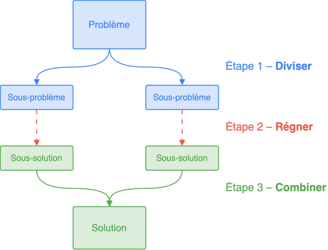
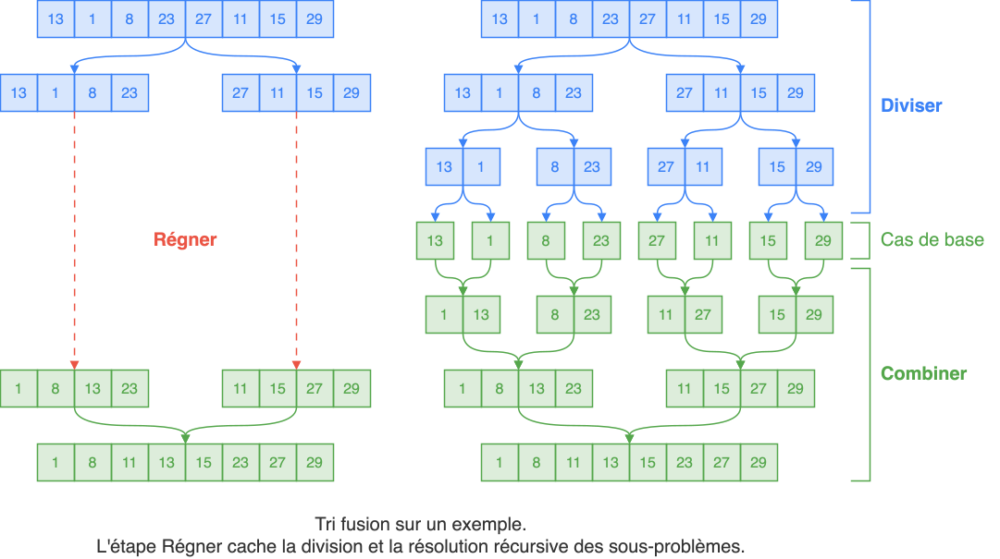
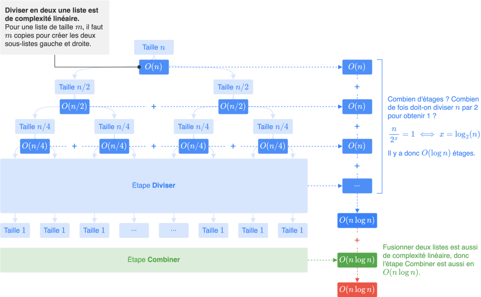

## Définition

{ width="400px" .center-img }

Une fonction `résoudre(problème)` qui applique la méthode « Diviser pour régner » se déroule suivant les étapes :

* **Cas de base** : Si le `problème` est trivial, le résoudre immédiatement et renvoyer sa solution.

* **Diviser** : Sinon, diviser le `problème` en plusieurs sous-problèmes indépendants.
  
* **Régner** : Résoudre ces sous-problèmes récursivement (c'est-à-dire appeler `résoudre` sur ces sous-problèmes).

* **Combiner** : Combiner les différentes solutions des sous-problèmes pour obtenir la solution au problème initial et la renvoyer. C'est l'étape la plus difficile à élaborer.

Pour appliquer la stratégie « Diviser pour régner » à un problème, on raisonne principalement sur l'étape Combiner : on suppose que les sous-problèmes ont été résolus, et on réfléchit à la manière de les réunir pour reconstruire la solution du problème initial.


## Exemple : Tri Fusion

* Le **tri fusion** applique la stratégie « Diviser pour régner ». Ce tri consiste à :

    * **Cas de base** : Si la liste ne possède qu'un élément, elle est déjà triée, la renvoyer.
    * **Diviser** : Sinon, diviser en deux la liste à trier.
    * **Régner** : Trier récursivement les deux sous-listes.
    * **Combiner** : Fusionner les deux sous-listes triées en une liste triée et la renvoyer.

{ width="100%" .center-img }

* Une implémentation possible en Python :

    ```{.python .no-copy}
    def fusionner(A, B):
        """ Fusionne deux listes triées en une seule liste triée. """
        F = []
        a, b = 0, 0  # indices pour parcourir A et B
        while a < len(A) and b < len(B):
            if A[a] < B[b]:
                F.append(A[a])
                a += 1
            else:
                F.append(B[b])
                b += 1
        return F + A[a:] + B[b:]  # ajoute les éléments restants

    def tri_fusion(tab):
        if len(tab) == 1:  # cas de base
            return tab
        m = len(tab) // 2
        G, D = tab[:m], tab[m:]              # Étape 1. Diviser
        G, D = tri_fusion(G), tri_fusion(D)  # Étape 2. Régner 
        return fusionner(G, D)               # Étape 3. Combiner
    ```

* Cet algorithme de tri a une complexité en temps de $O(n \log n)$ (quasi-linéaire).


