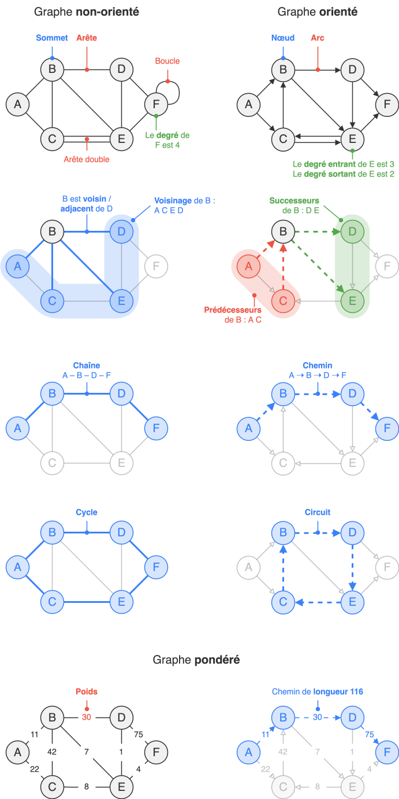
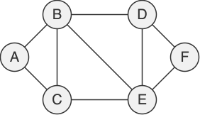
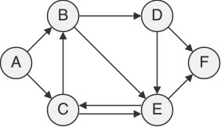
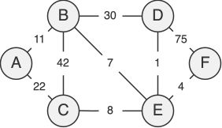
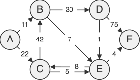
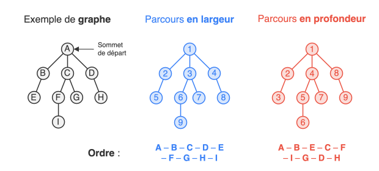

## Vocabulaire



## Représentations

Il existe trois représentations classiques d’un graphe en informatique :

- **Collection d’arêtes** : liste de couples représentant les arêtes.
- **Matrice d’adjacence** : matrice carré indiquant la présence d’une arête entre deux sommets.
- **Listes d’adjacence** : pour chaque sommet, on stocke la liste de ses voisins.

!!! info "Remarque"
    Ces représentations peuvent être adaptées selon les besoins : on peut par exemple représenter une arête par une classe, utiliser une liste chaînée pour les listes d’adjacence, encapsuler la structure du graphe dans une classe, ou encore stocker la liste des prédécesseurs pour les graphes orientés. Les exemples ci-dessous restent simples pour faciliter la compréhension.

=== "Graphe non-orienté"

    { .center-img }

    ```{ .python .no-copy title="Collection d'arêtes"}
    graphe = [
        ('A', 'B'), ('A', 'C'), ('B', 'C'),
        ('B', 'D'), ('B', 'E'), ('C', 'E'),
        ('D', 'E'), ('D', 'F'), ('E', 'F')
    ]
    ```

    <div class="grid" markdown>
    ```{ .python .no-copy title="Matrice d'adjacence"}
    # correspondance : A=0, B=1, C=2…
    graphe = [
        [0, 1, 1, 0, 0, 0],
        [1, 0, 1, 1, 1, 0], 
        [1, 1, 0, 0, 1, 0],
        [0, 1, 0, 0, 1, 1], 
        [0, 1, 1, 1, 0, 1],
        [0, 0, 0, 1, 1, 0],
    ]
    ```
    ```{ .python .no-copy title="Dictionnaire de listes d'adjacence"}
    graphe = {
        'A': ['B', 'C'],
        'B': ['A', 'C', 'D', 'E'],
        'C': ['A', 'B', 'E'],
        'D': ['B', 'E', 'F'],
        'E': ['B', 'C', 'D', 'F'],
        'F': ['D', 'E'],
    }
     
    ```
    </div>

=== "Graphe orienté"

    { .center-img }

    ```{ .python .no-copy title="Collection d'arêtes"}
    graphe = [
        ('A', 'B'), ('A', 'C'), ('C', 'B'),
        ('B', 'D'), ('B', 'E'), ('C', 'E'), ('E', 'C'),
        ('D', 'E'), ('D', 'F'), ('E', 'F')
    ]
    ```

    <div class="grid" markdown>
    ```{ .python .no-copy title="Matrice d'adjacence"}
    # correspondance : A=0, B=1, C=2…
    graphe = [
        [0, 1, 1, 0, 0, 0],
        [0, 0, 0, 1, 1, 0],
        [0, 1, 0, 0, 1, 0],
        [0, 0, 0, 0, 1, 1],
        [0, 0, 1, 0, 0, 1],
        [0, 0, 0, 0, 0, 0],
    ]
    ```
    ```{ .python .no-copy title="Dictionnaire de listes d'adjacence"}
    graphe = {
        'A': ['B', 'C'],
        'B': ['D', 'E'],
        'C': ['B', 'E'],
        'D': ['E', 'F'],
        'E': ['C', 'F'],
        'F': [],
    }
     
    ```
    </div>

=== "Graphe non-orienté pondéré"

    { .center-img }

    ```{ .python .no-copy title="Collection d'arêtes"}
    graphe = [
        ('A', 'B', 11), ('A', 'C', 22), ('B', 'C', 42),
        ('B', 'D', 30), ('B', 'E',  7), ('C', 'E',  8),
        ('D', 'E',  1), ('D', 'F', 75), ('E', 'F',  4)
    ]
    ```

    ```{ .python .no-copy title="Matrice d'adjacence"}
    # correspondance : A=0, B=1, C=2…
    graphe = [
        [ 0, 11, 22,  0,  0,  0],
        [11,  0, 42, 30,  7,  0], 
        [22, 42,  0,  0,  8,  0],
        [ 0, 30,  0,  0,  1, 75], 
        [ 0,  7,  8,  1,  0,  4],
        [ 0,  0,  0, 75,  4,  0],
    ]
    ```

    ```{ .python .no-copy title="Dictionnaire de listes d'adjacence"}
    graphe = {
        'A': [('B', 11), ('C', 22)],
        'B': [('A', 11), ('C', 42), ('D', 30), ('E', 7)],
        'C': [('A', 22), ('B', 42), ('E',  8)],
        'D': [('B', 30), ('E',  1), ('F', 75)],
        'E': [('B',  7), ('C',  8), ('D',  1), ('F', 4)],
        'F': [('D', 75), ('E',  4)],
    }
    ```

=== "Graphe orienté pondéré"

    { .center-img }

    ```{ .python .no-copy title="Collection d'arêtes"}
    graphe = [
        ('A', 'B', 11), ('A', 'C', 22), ('C', 'B', 42),
        ('B', 'D', 30), ('B', 'E',  7), ('C', 'E',  5), ('E', 'C',  8),
        ('D', 'E',  1), ('D', 'F', 75), ('E', 'F',  4)
    ]
    ```

    <div class="grid" markdown>
    ```{ .python .no-copy title="Matrice d'adjacence"}
    # correspondance : A=0, B=1, C=2…
    graphe = [
        [0, 11, 22,  0, 0,  0],
        [0,  0,  0, 30, 7,  0],
        [0, 42,  0,  0, 5,  0],
        [0,  0,  0,  0, 1, 75],
        [0,  0,  8,  0, 0,  4],
        [0,  0,  0,  0, 0,  0],
    ]
    ```
    ```{ .python .no-copy title="Dictionnaire de listes d'adjacence"}
    graphe = {
        'A': [('B', 11), ('C', 22)],
        'B': [('D', 30), ('E',  7)],
        'C': [('B', 42), ('E',  5)],
        'D': [('E',  1), ('F', 75)],
        'E': [('C',  8), ('F',  4)],
        'F': [],
    }
     
    ```
    </div>

En notant $n$ le nombre de sommets et $m$ le nombre d'arêtes :

<div class="center-table" markdown>
|                                       | Collection d'arêtes | Matrice d'adjacence |  Listes d'adjacence  |
| ------------------------------------- | :-----------------: | :-----------------: | :------------------: |
| **Espace mémoire**                    |       $O(m)$        |      $O(n^2)$       |      $O(n + m)$      |
| **$u$ et $v$ connectés ?**            |       $O(m)$        |       $O(1)$        | $O(\mathrm{deg}(u))$ |
| **Parcourir les voisins d’un sommet** |       $O(m)$        |       $O(n)$        | $O(\mathrm{deg}(u))$ |
</div>

Puisque le parcours du voisinage est au cœur de la majorité des algorithmes sur les graphes, la représentation par listes d’adjacence est la plus couramment utilisée.

## Parcours en largeur / profondeur

De la même manière que l'on explore les éléments d'une liste pour les découvrir, le parcours d'un graphe implique **l'exploration de ses sommets** en suivant les arêtes qui les connectent. Il existe deux parcours classiques de graphe :

* Le **parcours en largeur** (en anglais *Breath First Search*, **BFS**) consiste à explorer un graphe en commençant par un sommet de départ, puis en se déplaçant vers ses voisins avant de passer aux voisins des voisins etc. C'est un parcours qui découvre les sommets par ordre croissant de leur distance au sommet de départ (distance en terme du nombre d'arêtes qui les séparent).

* Le **parcours en profondeur** (en anglais *Depth First Search*, **DFS**) consiste à aller le plus loin possible dans une direction avant de revenir en arrière si on tombe sur une impasse.



Correctement implémentés, ces deux parcours visitent chaque sommet et chaque arête une seule fois, d’où une complexité en temps de $O(n + m)$.

=== "Pseudocode BFS"

    <div class="transparent-codeblock annotate" markdown>
    <pre>
    **fonction** parcours_largeur(graphe, sommet_depart) :
        initialiser une file et enfiler le sommet de départ à la file
        marquer le sommet de départ (1)
        **tant que** la file n'est pas vide :
            défiler un sommet de la file et le traiter/visiter
            mettre tous ses voisins non marqués dans la file et les marquer
    </pre>
    </div>

    1. Le marquage est un simple booléen associé à chaque sommet. Il signifie que le sommet a été visité ou qu'il se situe dans la file des sommets à visiter. Un sommet non-marqué est donc un sommet non-découvert.

=== ":material-language-python: Code Python BFS"

    ```{ .python .no-code }
    def parcours_largeur(G, s):
        F = File() #(1)!
        F.enfiler(s)
        M = {s} #(2)!
        while not F.est_vide():
            u = F.defiler()
            print('On visite le sommet', u)  # ou tout autre traitement
            for v in G[u]: #(2)!
                if v not in M:
                    F.enfiler(v)
                    M.add(v)
    ```

    1. On suppose que la classe `File` existe. Certaines implémentations utilisent une simple liste.
    2. Les sommets marqués `M` sont réunis dans un **ensemble**, `#!py set` en python. Cette structure peut se voir comme un dictionnaire composé uniquement de clés. Certaines implémentations utilisent une simple liste ou encore un dictionnaire.
    3. Le graphe est ici représenté sous la forme d'un dictionnaire de listes d'adjacence.

=== "Pseudocode DFS"

    <div class="transparent-codeblock annotate" markdown>
    <pre>
    **fonction** parcours_profondeur(graphe, u) :
        visiter/traiter u
        **pour** tous les sommets voisins v de u :
            **si** v n'a pas été visité :
                appeler (récursivement) parcours_profondeur(graphe, v)
    </pre>
    </div>

    Le parcours en profondeur peut être aussi implémenté itérativement à l'aide d'une **pile**. Cette pile remplace la pile des différents appels.

=== ":material-language-python: Code Python DFS"

    ```{ .python .no-code }
    def parcours_profondeur(G, u, visites):
        visites.append(u)
        print('On visite le sommet', u)  # ou tout autre traitement
        for v in G[u]:
            if v not in visites:
                parcours_profondeur(G, v, visites)
    ```

    Pour appeler cette fonction : `parcours_profondeur(G, sommet_depart, [])`.