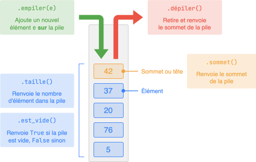
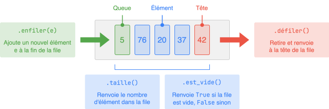
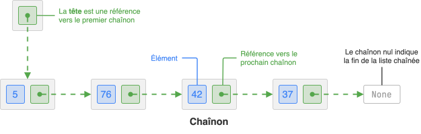
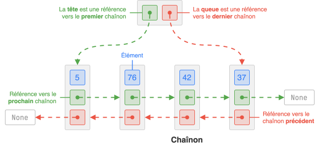

## Vocabulaire

* Une **structure de données** est une manière de stocker et d'organiser un ensemble de données (ou **éléments**, ou valeurs) pour les manipuler plus facilement. Par exemple, les tableaux dynamiques (`#!py list`), les dictionnaires (`#!py dict`) ou les graphes sont des structures de données.

* Une **interface** décrit un ensemble d'opérations (ou **primitives**) abstraites qu'une structure de données doit offrir, établissant ainsi une sorte de contrat avec l'utilisateur de cette structure. Peu importe la manière dont la structure est implémentée, son interface demeure inchangée.

* Une structure est dite **linéaire** quand ses éléments sont organisés les uns à la suite des autres. Une liste est une structure linéaire, un graphe n'est pas une structure linéaire.

## Pile (LIFO)

{ .center-img }

Une **pile** est une structure de données fondée sur le principe du « dernier entré, premier sorti » (en anglais « Last In, First Out », **LIFO**). C’est le principe même de la pile d’assiettes : c’est la dernière assiette posée sur la pile d’assiettes sales qui sera la première lavée.


## File (FIFO)

{ .center-img }

Une **file** est une structure de données fondée sur le principe du « premier entré, premier sorti » (en anglais « First In, First Out », **FIFO**). Une file d'attente aux caisses d'un supermarché en est la parfaite analogie.

## Liste chaînée

{ .center-img }

Une **liste chaînée** est une structure de données linéaire composée de **chaînons** (ou nœuds). Chaque chaînon contient un élément et une référence vers le chaînon suivant. Une telle structure ne stockera alors que la référence du premier chaînon, appelé tête.

Contrairement à un tableau dynamique (`#!py list`), les éléments d'une liste chaînée ne sont pas stockés de manière contiguës dans la mémoire. Ainsi, l'opération d'insertion et de suppression d'un élément se déroule en temps constant, mais en contrepartie,  l'accès au $i$-ème élément d'une liste chaînée s'effectue en temps linéaire.

## Liste doublement chaînée

{ .center-img }

Une liste chaînée a un seul sens de parcours, on la parcours toujours en partant de la tête. Pour remédier à ce problème, on peut inclure une référence au chaînon précédent dans chaque chaînon : on aboutit alors à une nouvelle structure de données linéaire appelée **liste doublement chaînée**.

## Comparaison des différents conteneurs

<div class="center-table" markdown>
| Opération                              |            Liste chaînée             |       Liste doublement chaînée       |    Tableau dynamique `#!py list`     |
| -------------------------------------- | :----------------------------------: | :----------------------------------: | :----------------------------------: |
| Accès à l’élément d’indice $i$         |  <span class="hl-red">$O(n)$</span>  |  <span class="hl-red">$O(n)$</span>  | <span class="hl-green">$O(1)$</span> |
| Insertion en tête                      | <span class="hl-green">$O(1)$</span> | <span class="hl-green">$O(1)$</span> |  <span class="hl-red">$O(n)$</span>  |
| Insertion en fin                       |  <span class="hl-red">$O(n)$</span>  | <span class="hl-green">$O(1)$</span> | <span class="hl-green">$O(1)$</span> |
| Suppression en tête                    | <span class="hl-green">$O(1)$</span> | <span class="hl-green">$O(1)$</span> |  <span class="hl-red">$O(n)$</span>  |
| Suppression en fin                     |  <span class="hl-red">$O(n)$</span>  | <span class="hl-green">$O(1)$</span> | <span class="hl-green">$O(1)$</span> |
| Adapté pour implémenter une **pile** ? |        :material-check-bold:         |        :material-check-bold:         |        :material-check-bold:         |
| Adapté pour implémenter une **file** ? |        :material-close-thick:        |        :material-check-bold:         |        :material-close-thick:        |
</div>


## Implémentation en Python

=== "Pile"

    ```{.python .no-copy}
    class Pile:
        def __init__(self):
            self.data = []  # tableau comme conteneur

        def taille(self):
            return len(self.data)

        def est_vide(self):
            return self.taille() == 0

        def sommet(self):
            return self.data[-1]

        def empiler(self, e):
            self.data.append(e)  # O(1)

        def depiler(self):
            return self.data.pop(-1)  # O(1) 
    ```

=== "File"

    ```{.python .no-copy}
    class File:
        def __init__(self):
            self.data = []  # tableau comme conteneur

        def taille(self):
            return len(self.data)

        def est_vide(self):
            return self.taille() == 0

        def sommet(self):
            return self.data[-1]

        def enfiler(self, e):
            self.data.append(e)  # O(1)

        def defiler(self):
            return self.data.pop(0)  # O(n) aïe ! 
    ```

    Une implémentation optimale d'une file utilise plutôt une **liste doublement chaînée** pour stocker les éléments, car elle permet d’ajouter (`enfiler`) ou de retirer (`défiler`) un élément en **temps constant** \( O(1) \).

=== "Liste chaînée"

    ```{ .python .no-copy}
    class Chainon:
        def __init__(self, element, chainon_suivant = None):
            self.element = element
            self.suivant = chainon_suivant

    class ListeChainee:
        def __init__(self):
            self.tete = None  # référence vers le premier chaînon

        def est_vide(self):
            return self.tete is None

        def inserer_devant(self, e):
            """ Insère un nouveau chaînon à la tête en O(1). """
            self.tete = Chainon(e, self.tete)

        def retirer_tete(self):
            """ Retire et renvoie la tête en O(1). """
            if self.est_vide():
                return None
            e = self.tete.element
            self.tete = self.tete.suivant #(1)!
            return e

        def taille(self):
            """ Renvoie la taille de la liste en O(n). """ #(2)!
            n = 0
            courant = self.tete
            while courant is not None:
                n += 1
                courant = courant.suivant
            return n
    ```

    1. Puisque le chaînon que l'on déconnecte ne sera plus accessible dans le
    programme, Python le supprimera de la mémoire par le biais du *garbage collector*.

    2. On peut ajouter un attribut `self.taille` à la liste chaînée, et le maintenir à jour à chaque ajout ou suppression de chaînon, ce qui permet de connaître la taille en O(1).

    Cette implémentation de liste chaînée propose uniquement quelques primitives à titre d’exemple.


