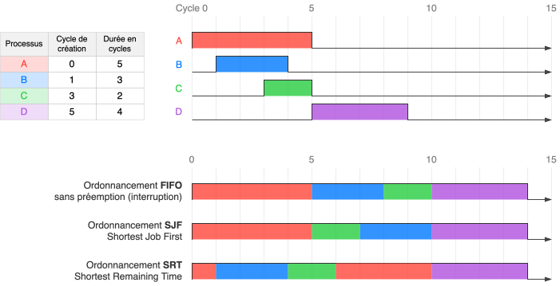

## Architecture de Von Neumann

Le **cycle** d'une machine séquentielle se répète jusqu'à l'arrêt de la machine :

* :material-numeric-1-circle: &nbsp; Le processeur **récupère** l'instruction à exécuter en mémoire.
* :material-numeric-2-circle: &nbsp; Le processeur **décode** et **exécute** l'instruction.
* :material-numeric-3-circle: &nbsp; Le processeur passe à l'instruction suivante et ainsi de suite.

Un programme est une suite d'**instructions** en code machine, c'est-à-dire une suite d’octets que le processeur décode puis exécute.

## Processus

### Création et états d'un processus

* Quand un programme est lancé, un processus est créé par le système d'exploitation. Un processus contient :
    

    * :material-file-code: &nbsp; Les **instructions** du programme à exécuter (chargées en mémoire).
    * :fontawesome-solid-memory: &nbsp; Un **espace mémoire** réservé.
    * :fontawesome-solid-hard-drive: &nbsp; Des droits d’accès à certaines **ressources** (fichiers, périphériques…).
  
    

* Chaque processus possède un identifiant unique (**PID**) et celui de son parent (PPID). Cela permet de structurer les processus en arbre. Si un processus parent se termine, tous ses processus enfants (et leur descendance) sont également arrêtés.

* Un processeur n’exécute qu’une seule instruction à la fois, donc un seul processus à la fois. Pour donner l'illusion de simultanéité d'exécution, les processus se partagent le processeur à tour de rôle. Ainsi, un processus peut donc se trouver dans différents **états** :

    { .center-img }

### Ordonnancement des processus

L'**ordonnanceur** est un programme du système d’exploitation qui choisit le processus à élire, l’interrompt si nécessaire, et définit le temps processeur (mesuré en cycles) qui lui est alloué. Pour cela, il peut appliquer différentes **stratégies d’ordonnancement**, selon des critères comme la priorité des processus, leur durée estimée, leur ordre d’arrivée, un partage équitable du temps etc. Voici quelques stratégies d'ordonnancement pour les quatre processus suivants :

### Interblocage (deadlock)

L'**interblocage** est une situation où plusieurs processus sont bloqués, chacun attendant une ressource détenue par un autre, aboutissant à un blocage mutuel et infini.

  <button class="nav prev" markdown="span">:material-arrow-left-circle:</button>
  

    
    
    
    
    
    
    
    
    
    
    
    
  

  <button class="nav next" markdown="span">:material-arrow-right-circle:</button>
  

    
    
    
    
    
    
    
    
    
    
    
    
  

