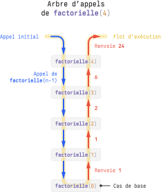
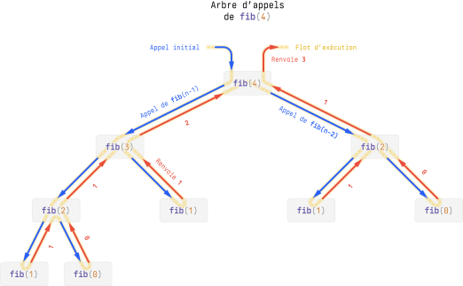

* Une fonction est dite **récursive** si elle s'appelle elle-même au cours de son exécution.

	```{ .python .no-copy title="Exemple de fonction récursive" } 
	def factorielle(n):
	    if n == 0:  # condition d'arrêt ou cas de base
	        return 1
	    return n * factorielle(n - 1)  # factorielle s'appelle elle-même
	```

* La **condition d'arrêt** située au début de toute fonction récursive, définit le **cas de base** et permet d'arrêter la chaîne des appels.

* Si un programme récursif peut se traduire dans un style itératif (avec de simples boucles), et inversement, aborder de manière récursive un problème est parfois plus facile.
    <div class="grid" markdown>
    ```{ .python .no-copy title="Style récursif" } 
    def factorielle(n):
        if n == 0:  # cas de base
            return 1
        else:
            return n * factorielle(n-1)
    ```
    ```{ .python .no-copy title="Style itératif" } 
    def factorielle(n):
        produit = 1
        for facteur in range(n + 1):
            produit *= facteur
        return produit
    ```
    </div>

* Il est essentiel de comprendre le déroulement d'une fonction récursive. Par exemple, si on appelle `#!py factorielle(5)`, cette fonction devra attendre le résultat de `#!py factorielle(4)` avant de pouvoir renvoyer son propre résultat. Et de la même manière, `#!py factorielle(4)` devra à son tour attendre le résultat de `#!py factorielle(3)`. Et ainsi de suite, jusqu'au cas de base.

{ width="50%" .center-img .invert}

* Il est courant de partir d'une définition mathématique récursive et de la traduire en code :

    <div class="grid" markdown>
    <div style="font-size: 0.65rem;">
    $$
    \mathrm{fib}(n) = 
    \begin{cases}
    0 & \text{si } n = 0\newline
    1 & \text{si } n = 1\newline
    \mathrm{fib}(n - 1)  + \mathrm{fib}(n - 2) & \text{sinon}
    \end{cases}
    $$
    </div>
    ```{ .python .no-copy} 
    def fib(n):
        if n <= 1:  # cas de base
            return n
        return fib(n - 1) + fib(n - 2)
    ```
    </div>

* Un **arbre d'appels** permet de visualiser l'ordre des appels récursifs :

{ width="100%" .center-img .invert}