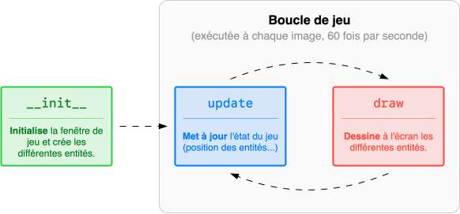
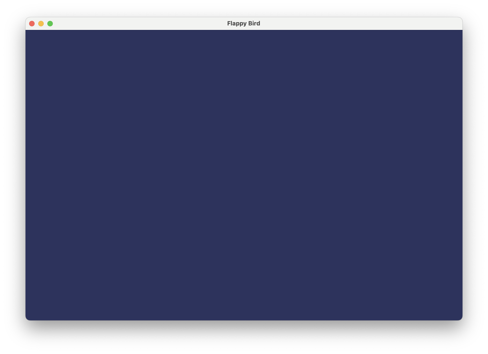
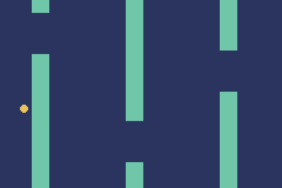
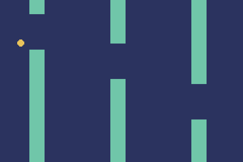
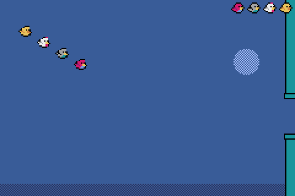

# Flappy Bird

**Flappy Bird** est un jeu mobile simple, frustrant et addictif, qui consiste à faire sautiller un oiseau le plus longtemps possible, tout en évitant des tuyaux qui défilent à l'écran. Le projet consiste à recréer ce jeu à l'aide du module **Pyxel** en suivant le paradigme de la **POO**.

<figure class="video-container" style="width: 200px;">
<video autoplay loop muted playsinline class="rounded">
    <source src="../assets/flappy.mp4" type="video/mp4">
</video>
</figure>

## Un programme minimal

Le module Pyxel est un moteur de jeu qui utilise une **boucle de jeu**. Tant que la fenêtre est ouverte, Pyxel appelle les fonctions `update` et `draw` à chaque image :

{ .center-img }

On regroupe le tout dans une `#!py class Jeu` afin d'organiser le code : les différentes données du jeu (comme l'oiseau, les tuyaux, le score etc.) deviennent des **attributs**, et les fonctions qui agissent sur ces données (`update`, `draw`, etc.) deviennent des **méthodes**. Cela permet d'éviter l'utilisation de variables globales : les méthodes accèdent aux données du jeu via `#!py self` car celles-ci sont des attributs de la classe.

=== "Code"

    ```python
    import pyxel

    class Jeu:
        def __init__(self):
            pyxel.init(240, 160, 'Flappy Bird', fps=60) #(2)!
            pyxel.run(self.update, self.draw) #(3)!

        def update(self):
            pass #(4)!

        def draw(self):
            pyxel.cls(1) #(5)!


    Jeu() #(1)!
    ```

    1. On instancie un seul objet `Jeu`, ce qui exécute immédiatement `__init__` et donc la boucle de jeu avec `pyxel.run`.
    
    2. On crée une **fenêtre** de 240×160 pixels, intitulée « Flappy Bird », qui s'actualise 60 fois par seconde.
   
    3. On démarre la **boucle de jeu**. On donne à Pyxel les méthodes `#!py self.update` et `#!py self.draw` de la classe.

    4. Pour l'instant, il n'y a rien à mettre à jour.

    5. On efface l'écran en le remplissant avec la couleur 1 (bleu foncé).

=== "Rendu"

    {.center-img}


Ce code constitue **le point de départ** pour n'importe quel jeu !

## Un oiseau qui tombe et saute

On modélise un oiseau par une `#!py class Oiseau` en regroupant les données qui le définissent :

```python
class Oiseau:
    def __init__(self, y):
        self.y = y #(1)! 
        self.vy = 0 #(2)! 
```

1. **Position** verticale de l'oiseau à l'écran. Comme l'oiseau ne se déplace pas horizontalement, son abscisse peut être fixée. Libre à vous de définir `#!py self.x` pour modifier ce comportement.

2. **Vitesse** verticale de l'oiseau (nulle au départ).
   
On y ajoute ensuite les méthodes `update` et `draw` spécifiques à un oiseau. Elles seront appelées dans la boucle générale de jeu.

```python
class Oiseau:
    def __init__(self, y):
        self.y = y
        self.vy = 0

    def update(self):
        self.y += self.vy #(1)!
        self.vy += 0.05 #(2)!

    def draw(self):
        pyxel.circ(20, self.y, 3, 10) #(3)!
```

1. Mise à jour de la position verticale.
2. La gravité accélère l'oiseau vers le bas.
3. Dessine à l'écran un disque  aux coordonnées (20, `#!py self.y`) de rayon 3 et de couleur 10 (jaune).

La classe `Jeu` est ainsi modifiée pour y ajouter un oiseau :

```python hl_lines="3 8 12"
class Jeu:
    def __init__(self):
        self.oiseau = Oiseau(20)
        pyxel.init(240, 160, 'Flappy Bird', fps=60) 
        pyxel.run(self.update, self.draw) 

    def update(self):
        self.oiseau.update() 

    def draw(self):
        pyxel.cls(1) 
        self.oiseau.draw()
```

<div class="grid cards" markdown>
{ .center-img .rounded }

{ .center-img .rounded }
</div>

Voilà un bel oiseau soumis par la gravité ! On peut facilement faire sauter l'oiseau en modifiant sa vitesse verticale à l'appui de la touche ++space++ :

```python hl_lines="5 6"
class Oiseau:
    # ...
    def update(self):
        # ...
        if pyxel.btnp(pyxel.KEY_SPACE):
            self.vy = -2 
```

Libre à vous de modifier les valeurs d'intensité de la gravité et de saut. Ou même de les définir comme constantes ou comme attributs afin de les faire varier au cours du jeu...

## Un Flappy Bird rudimentaire

<div class="circle-ol" markdown>

1. Créer une `#!py class Obstacle` qui modélise **une paire de tuyaux** qui défile à l'écran (ou un seul tuyau si vous voulez découpler les deux). Ajouter un seul obstacle à la `#!py class Jeu` pour tester votre classe. Ne pas gérer les collisions.

    { .center-img .rounded width="300px"  }

    ??? info "Quelques indications"

        * Utiliser la fonction Pyxel `pyxel.rect` pour dessiner un rectangle (voir [documentation](https://clogique.fr/nsi/premiere/fil_rouge/documentation-pyxel-2023.pdf)).
        * Un obstacle est au moins caractérisé par sa **position horizontale** et **la hauteur** de son tuyau supérieur. Le reste (la largeur de l'obstacle, la hauteur entre les deux tuyaux, la vitesse horizontale) peut être défini comme des constantes.

2. Dans la `#!py class Jeu`, définir plutôt une **liste d'obstacles** et y ajouter de nouveaux obstacles au fur et à mesure. Ne pas oublier de supprimer les obstacles qui sortent de l'écran !

    { .center-img .rounded width="300px"  }

3. Détecter les **collisions** potentielles entre l'oiseau et les obstacles.

    { .center-img .rounded width="300px"  }

    ??? info "Collision entre un cercle et un rectangle"

        Tout d'abord, un **cercle** et un **point** sont en collision si la distance entre le centre du cercle et le point est inférieure ou égale au rayon du cercle :

        ```python
        dx = cercleX - pointX
        dy = cercleY - pointY
        return dx * dx + dy * dy <= cercleRayon * cercleRayon #(1)!
        ```

        1. Équivalent à `#!py return sqrt(dx * dx + dy * dy) <= cercleRayon` en évitant le coûteux calcul d'une racine carrée !

        Pour tester la collision entre un **cercle** et un **rectangle**, il suffit de déterminer le point sur le rectangle **le plus proche** du centre du cercle, et vérifier ensuite la collision entre ce point et le cercle. Pour déterminer ce point si le rectangle n'est pas tourné, on ramène les coordonnées du centre du cercle dans les limites du rectangle :

        ```python
        PointProcheX = max(rectX, min(cercleX, rectX + rectLargeur))
        PointProcheY = max(rectY, min(cercleY, rectY + rectHauteur))
        ```

        <figure class="video-container" style="width: 300px;">
        <video autoplay loop muted playsinline class="rounded mac-shadow">
            <source src="../assets/collision.mp4" type="video/mp4">
        </video>
        </figure>

        En combinant avec le programme précédent :

        ```python
        dx = cercleX - max(rectX, min(cercleX, rectX + rectLargeur))
        dy = cercleY - max(rectY, min(cercleY, rectY + rectHauteur))
        return dx * dx + dy * dy <= cercleRayon * cercleRayon
        ```


4. Dans la `#!py class Oiseau`, ajouter un attribut booléen `#!py self.en_vie` et une méthode `mourir`. Lorsqu'une collision se produit, l'oiseau meurt et ne peut plus sauter. Si l'oiseau tombe trop bas, relancer la partie via une méthode `reset` de la classe `#!py class Jeu`.

    { .center-img .rounded width="300px"  }
</div>

## À votre sauce

{ .center-img .rounded width="500px" }

C'est la partie créative du projet ! Vous pouvez enrichir votre jeu Flappy Bird à votre guise ! Quelques idées pour vous inspirer :

* Ajouter un score : compter le nombre de tuyaux franchis, la durée de vol, etc.
* Ajouter des vies supplémentaires pour le joueur.
* Ajouter des pièces à collecter entre les tuyaux.
* Personnaliser les graphismes : utiliser une image pour l'oiseau, améliorer le dessin des tuyaux, ajouter un fond qui défile doucement...
* Créer plusieurs oiseaux pour un mode Battle Royale !
* Introduire des zones avec une gravité différente, des tuyaux plus étroits ou plus rapides.

Laissez libre cours à votre imagination et amusez-vous !

