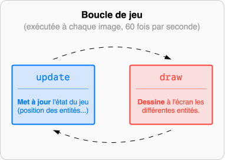
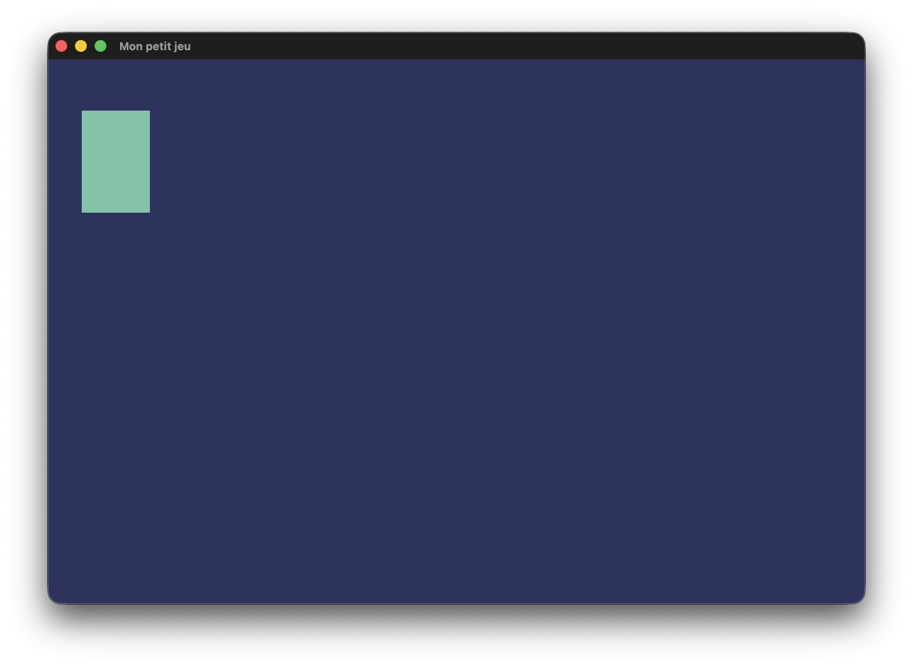
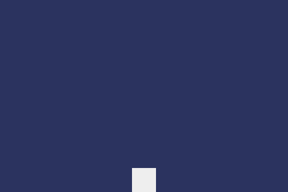

# Petit jeu de fin d'année

Il est temps d'enrichir le site en jeux ! On s'appuie sur **[Pyxel](https://kitao.github.io/pyxel/web/user-guide/)**, un moteur de jeu Python simple à prendre en main. En binôme ou en solo, choisissez un projet de jeu. Voici quelques idées :

* [Jeu du dinosaure](https://dinosaur.game/fr/)
* Casse-briques
* Pong à 2 joueurs
* Tron à 2 joueurs
* [2048](https://jeu2048.fr/)
* [Sokoban](https://www.mathsisfun.com/games/sokoban.html)


## Un programme minimal


Pyxel repose sur une **boucle de jeu**. Tant que la fenêtre est ouverte, Pyxel appelle les fonctions `update` et `draw` à chaque image :

{ .center-img }


Sur Thonny, après y avoir installé le module Pyxel, ou en ligne sur [Pyxel Code Maker](https://kitao.github.io/pyxel/web/code-maker/), commencez avec le code minimal suivant :

=== "Code"

    ```python
    import pyxel

    pyxel.init(240, 160, "Mon petit jeu", fps=60)  # (1)!


    def update():
        if pyxel.btnp(pyxel.KEY_Q):  # (3)!
            pyxel.quit()


    def draw():
        pyxel.cls(1)  # (4)!
        pyxel.rect(10, 15, 20, 30, 11)  # (5)!


    pyxel.run(update, draw)  # (2)!
    ```

    1. On crée une **fenêtre** de 240×160 pixels, intitulée « Mon petit jeu », qui s'actualise 60 fois par seconde.

    2. On démarre la **boucle de jeu**. On donne à Pyxel les fonctions `#!py update` et `#!py draw`.

    3. Si la touche Q est pressée, on quitte le jeu !

    4. On efface l'écran en le remplissant avec la couleur 1 (bleu foncé).

    5. On dessine un rectangle de 20×30 pixels, dont le coin haut-gauche est en (10, 15), avec la couleur 11 (vert clair).


=== "Rendu"

    {.center-img}


Impressionant, non ? N'oubliez pas que Victor Hugo a commencé Les Misérables par une page blanche.

## Un truc qui bouge

Pour qu'un joueur se déplace, sa position doit **varier**, il faut donc une variable ! On va ici tricher un peu et utiliser des variables **globales**, accessibles depuis n'importe quelle fonction sans avoir à les passer en paramètre.


=== "Code"

    ```python
    import pyxel

    pyxel.init(240, 160, "Mon petit jeu", fps=60)


    x = 110  # position x du joueur


    def update():
        global x  # à ajouter si vous modifiez la variable

        if pyxel.btnp(pyxel.KEY_Q):  # btnp : True seulement à l'appuie
            pyxel.quit()

        if pyxel.btn(pyxel.KEY_LEFT):  # btn : True si la touche est enfoncée
            x -= 1
        if pyxel.btn(pyxel.KEY_RIGHT):
            x += 1


    def draw():
        pyxel.cls(1)
        pyxel.rect(x, 140, 20, 20, 7)


    pyxel.run(update, draw)
    ```


=== "Rendu"

    { .center-img .rounded }


Si votre jeu a de la gravité, il faudra aussi modéliser la **vitesse** du joueur. Une variable de plus, qui met à jour la position du joueur à chaque image.


=== "Code"

    ```python
    import pyxel

    pyxel.init(240, 160, "Mon petit jeu", fps=60)


    x = 110  # position x du joueur
    y = 140  # position y du joueur
    vy = 0  # vitesse y du joueur


    def update():
        global x, y, vy

        if pyxel.btnp(pyxel.KEY_Q):
            pyxel.quit()

        if pyxel.btn(pyxel.KEY_LEFT):
            x -= 2
        if pyxel.btn(pyxel.KEY_RIGHT):
            x += 2
        if pyxel.btnp(pyxel.KEY_SPACE):
            vy = -5  # une impulsion vers le haut

        vy += 0.2  # la gravité est une accélération vers le bas !
        y += vy
        y = min(y, 140)  # simule le "sol"


    def draw():
        pyxel.cls(1)
        pyxel.rect(x, y, 20, 20, 7)


    pyxel.run(update, draw)
    ```


=== "Rendu"

    { .center-img .rounded }


Bon, ici le <span style="text-decoration: line-through;">carré de sucre</span> joueur peut s'échapper de l'écran et sauter en l'air autant de fois qu'il le souhaite, c'est encore le Far West ! La suite, c'est à vous de jouer... vous verrez rapidement que coder un jeu, c'est pas aussi simple qu'il n'y paraît !


## Besoin d'aide ? Les grandes lignes pour le jeu du Dinosaure.

Ne pas hésiter à consulter la [documentation Pyxel](https://kitao.github.io/pyxel/web/api-reference/) (afficher du texte, changer la couleur, ajouter des sprites etc.) tout au long de vos sessions de codage !

* Supprimer les déplacements horizontaux du joueur
* Empêcher le joueur de sauter s'il n'est pas au sol
* Faire apparaître un bloc ennemi qui se déplace de droite à gauche
* Gérer plusieurs ennemis simultanément (une **liste** de positions)
* Faire apparaître de nouveaux ennemis régulièrement (`#!py pyxel.frame_count` sera utile) ; et supprimer ceux qui disparaissent de l'écran.
* Afficher le score (distance parcourue)
* Détecter les collisions entre le joueur et les ennemis, et relancer la partie
* Augmenter progressivement la vitesse des ennemis
* Remplacer les rectangles par des **sprites**
* Ajouter un décor avec un effet de parallaxe

!!! warning "IA interdite"
    Les jeux générés (même en partie) par un LLM ne seront pas publiés sur le site. Vous avez le droit à RouquanGPT cependant.