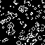

# Exposition

## Démineur
### Le prof, Mars 2025
Le jeu du démineur consiste à localiser toutes les mines cachées, avec pour seule indication le nombre de mines adjacentes.

[Télécharger le code :octicons-download-16:](assets/demineur/demineur.zip)
[Jouer en mode facile :material-open-in-new:](assets/demineur/demineur-facile.html)
[Jouer en mode expert :material-open-in-new:](assets/demineur/demineur-expert.html)

## Jeu de la vie
### Le prof, Mars 2025
Ce n'est pas vraiment un jeu, mais un petit automate cellulaire !

[Télécharger le code :octicons-download-16:](assets/jeudelavie/jeudelavie.py)
[Jouer au jeu de la vie :material-open-in-new:](assets/jeudelavie/jeudelavie.html)

